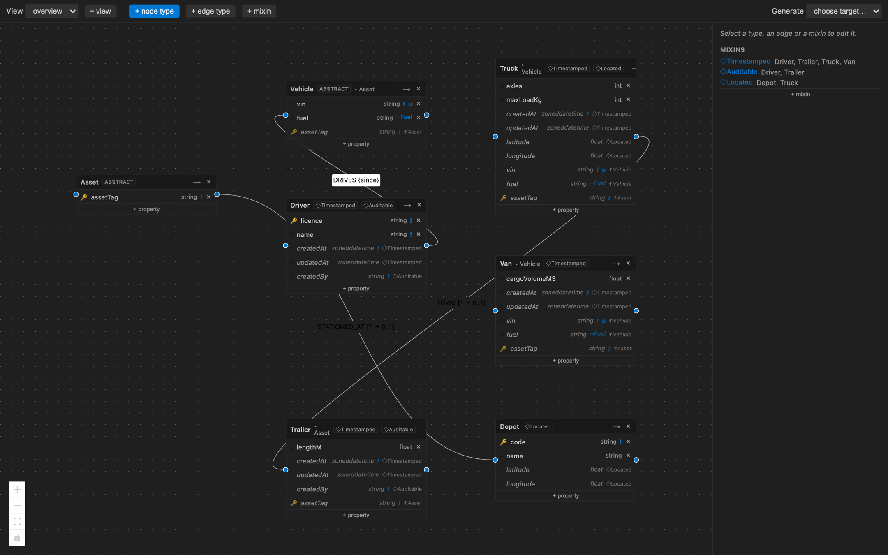
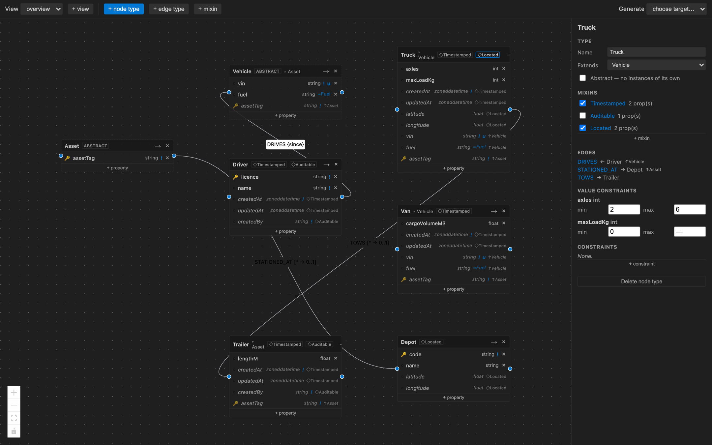
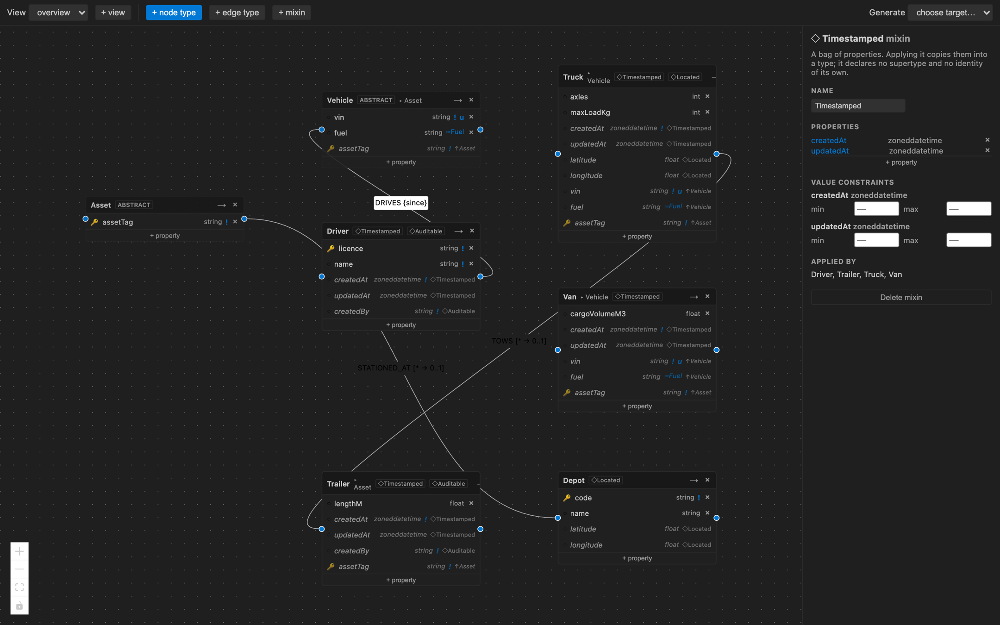

<h1 align="center">LPG Modeler</h1>

<p align="center">
  <strong>Design a property graph once. Generate every schema from it.</strong>
</p>

<p align="center">
  <a href="https://volland.github.io/lpg-modeler/">Documentation</a> ·
  <a href="https://marketplace.visualstudio.com/items?itemName=pavlyshyn.lpg-modeler">Marketplace</a> ·
  <a href="https://volland.github.io/lpg-modeler/examples.html">Examples</a> ·
  <a href="https://volland.github.io/lpg-modeler/model-format.html">Model format</a> ·
  <a href="https://volland.github.io/lpg-modeler/architecture.html">Design notes</a>
</p>

<p align="center">
  <a href="https://marketplace.visualstudio.com/items?itemName=pavlyshyn.lpg-modeler"></a>
  <a href="LICENSE"></a>
</p>

A VS Code extension and CLI for authoring Labeled Property Graph schemas as text, viewing them
as ERD-like diagrams, and generating database DDL and RDF artifacts from a single model.


## What it does

- **Authors the model as reviewable YAML**, validated by a contributed JSON Schema — so completion and hover come from the YAML tooling you already have.
- **Edits it on a canvas beside the file.** Every canvas action becomes a targeted text splice, applied as a workspace edit. Coordinates live in a sidecar, so moving a box produces no semantic diff.
- **Models inheritance and mixins as separate tools.** An abstract label hierarchy says what a thing *is* and carries keys and edges down to every descendant; a mixin is a bag of properties a type applies, with no supertype and no identity. Both are flattened before any generator sees the model.
- **Generates seven targets** from one model: LadybugDB DDL, Neo4j constraints, SHACL shapes, and an OWL ontology — plus three standards artifacts, GQL graph types (ISO/IEC 39075), PG-Schema, and LinkML.
- **Reports every downgrade.** Anything a target cannot enforce becomes an editor diagnostic *and* a comment at the lossy line of the artifact. Nothing disappears quietly.
- **Models lists, enums, open types and cardinality** — and cardinality is genuinely enforced where it can be: LadybugDB rejects a violating write, and SHACL bounds both directions.
- **Stays interoperable.** The model file is self-describing, its scalar types answer to their GQL names, and the JSON Schema is 2020-12 — so a model is readable outside this tool, not only inside it.
- **Runs in CI.** The same validation, with no editor present, so a pull request can be gated on schema validity.

Full feature tour: **https://volland.github.io/lpg-modeler/**

## The editor

The canvas opens beside the model file, in the manner of Markdown preview. Every box is a
node type, every row a property, and every action on it a targeted edit to the YAML.



This is [`fleet.lpg.yaml`](docs/examples/fleet.lpg.yaml), one of the downloadable examples
below. `Asset` and `Vehicle` are abstract — drawn with a dashed border and an `abstract`
badge, and emitting no table. `Truck` sits three levels down: `assetTag` arrives from
`Asset`, `vin` from `Vehicle`, and each inherited row names its source with `↑`. Properties
that came from a mixin are marked `◇` instead, because a supertype and a bag of properties
are not the same claim about a type. `STATIONED_AT` is declared once on `Asset` and drawn
on `Asset` alone: repeating it on four subtypes would suggest four declarations where the
model has one.

### Inheritance, in the inspector



Selecting a type shows what a diagram box has no room for. `Extends` is a dropdown over the
model's own types. Mixins are **checkboxes**, not a parent dropdown — applying one is set
membership, and a type may apply several. Under `Edges`, `DRIVES` and `STATIONED_AT` are
marked `↑Vehicle` and `↑Asset`: they are declared on an ancestor and reach this type through
it. That is the reading a modeller actually needs — *what can this type relate to* — and it
is a list rather than a picture.

### Mixins are edited in their own right



A mixin has no box on the canvas, because it is not a type. It gets the panel instead:
its properties, and every type applying it, so a change to `Timestamped` shows what it
would touch before you make it. Renaming one rewrites the `mixins:` list of every type that
names it, as a targeted edit.

Why the distinction is enforced rather than blurred: conflating reuse with subtyping
produces a hierarchy shaped by which properties happen to travel together rather than by
what a thing is. `createdAt` on twenty types does not make twenty subtypes of a
`Timestamped`. See [the metamodel notes](https://volland.github.io/lpg-modeler/model-format.html).

## Examples

Five complete models, each checked in continuous integration — a test resolves every one of
them and generates all seven targets, so the file you download is the file the test checked.

| Model | Shows |
| --- | --- |
| [`social.lpg.yaml`](docs/examples/social.lpg.yaml) | The starter: an abstract parent contributing a key, a mixin, and an edge with an abstract endpoint |
| [`fleet.lpg.yaml`](docs/examples/fleet.lpg.yaml) | **Inheritance and mixins**: a three-level abstract hierarchy, three mixins applied at different levels, and an edge declared once on the root |
| [`catalog.lpg.yaml`](docs/examples/catalog.lpg.yaml) | Enums, list-valued properties, a composite key, and an open type — where the targets start disagreeing |
| [`kinship.lpg.yaml`](docs/examples/kinship.lpg.yaml) | Endpoint bounds: exactly two parents, which no named multiplicity can express |
| [`booking.lpg.yaml`](docs/examples/booking.lpg.yaml) | Value bounds, patterns, named constraints, and the raw SHACL escape hatch |

Save one as `<name>.lpg.yaml` in a workspace — the extension matches on that suffix — then:

```bash
npx lpg-modeler-cli check fleet.lpg.yaml
npx lpg-modeler-cli emit  fleet.lpg.yaml --target ladybug --target shacl --out ./schema
```

Browse them with commentary: **https://volland.github.io/lpg-modeler/examples.html**

## Install

From the VS Code Marketplace:

```bash
code --install-extension pavlyshyn.lpg-modeler
```

The CLI, for continuous integration:

```bash
npx lpg-modeler-cli check model/domain.lpg.yaml
npx lpg-modeler-cli emit model/domain.lpg.yaml --target ladybug --out schema
```

## Repository layout

A monorepo of three packages.

| Package | Holds |
| --- | --- |
| [`packages/core`](packages/core) | Parsing, the intermediate representation, resolution, validation, targeted edits, and every generator |
| [`packages/cli`](packages/cli) | The `lpg` command, wrapping core for continuous integration |
| [`packages/vscode`](packages/vscode) | The extension: webview canvas, diagnostics, commands |

`core` must never import `vscode` — enforced by an ESLint rule and by a test that scans the
source. That single rule is what keeps generator tests runnable in plain Node with no editor
harness. See [the design notes](https://volland.github.io/lpg-modeler/architecture.html).

## Development

```bash
npm install
npm run build          # builds core, then cli, then the extension and its webview
npm test               # vitest, across all packages
npm run lint
```

To run the extension from source, open the repository in VS Code and launch the
**Run Extension** target, or package it:

```bash
cd packages/vscode
npx @vscode/vsce package --no-dependencies
```

The extension bundle is self-contained — `esbuild` inlines `@lpg/core` into
`out/extension.js`, so `--no-dependencies` is correct rather than a shortcut.

### Tests

Every generator has golden-file tests for output stability. The Ladybug target additionally
executes its generated DDL against an in-process LadybugDB instance and asserts that the
declared constraints really do reject invalid data — a golden file alone only proves that
output has not changed, not that it is valid.

### Documentation

Architecture and design intent live in [`lat.md/`](lat.md), a cross-linked knowledge graph
maintained with [lat.md](https://www.npmjs.com/package/lat.md). Run `lat check` before opening
a pull request. The published website is generated from [`docs/`](docs).

## License

MIT — see [LICENSE](LICENSE).
