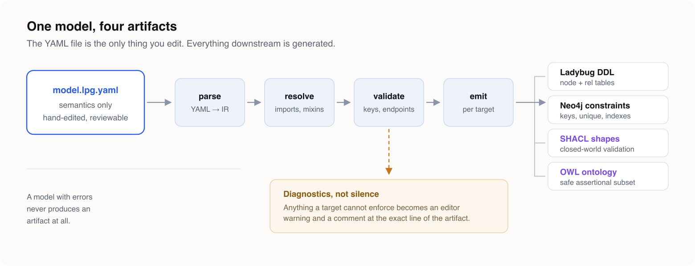

<h1 align="center">LPG Modeler</h1>

<p align="center">
  <strong>Design a property graph once. Generate every schema from it.</strong>
</p>

<p align="center">
  <a href="https://volland.github.io/lpg-modeler/">Documentation</a> ·
  <a href="https://marketplace.visualstudio.com/items?itemName=volland.lpg-modeler">Marketplace</a> ·
  <a href="https://volland.github.io/lpg-modeler/model-format.html">Model format</a> ·
  <a href="https://volland.github.io/lpg-modeler/architecture.html">Design notes</a>
</p>

<p align="center">
  <a href="https://marketplace.visualstudio.com/items?itemName=volland.lpg-modeler"></a>
  <a href="LICENSE"></a>
</p>

A VS Code extension and CLI for authoring Labeled Property Graph schemas as text, viewing them
as ERD-like diagrams, and generating database DDL and RDF artifacts from a single model.



## What it does

- **Authors the model as reviewable YAML**, validated by a contributed JSON Schema — so completion and hover come from the YAML tooling you already have.
- **Edits it on a canvas beside the file.** Every canvas action becomes a targeted text splice, applied as a workspace edit. Coordinates live in a sidecar, so moving a box produces no semantic diff.
- **Generates four targets** from one model: LadybugDB DDL, Neo4j constraints, SHACL shapes, and an OWL ontology.
- **Reports every downgrade.** Anything a target cannot enforce becomes an editor diagnostic *and* a comment at the lossy line of the artifact. Nothing disappears quietly.
- **Runs in CI.** The same validation, with no editor present, so a pull request can be gated on schema validity.

Full feature tour: **https://volland.github.io/lpg-modeler/**

## Install

From the VS Code Marketplace:

```bash
code --install-extension volland.lpg-modeler
```

The CLI, for continuous integration:

```bash
npx lpg check model/domain.lpg.yaml
npx lpg emit  model/domain.lpg.yaml --target ladybug --out schema
```

## Repository layout

A monorepo of three packages.

| Package | Holds |
| --- | --- |
| [`packages/core`](packages/core) | Parsing, the intermediate representation, resolution, validation, targeted edits, and every generator |
| [`packages/cli`](packages/cli) | The `lpg` command, wrapping core for continuous integration |
| [`packages/vscode`](packages/vscode) | The extension: webview canvas, diagnostics, commands |

`core` must never import `vscode` — enforced by an ESLint rule and by a test that scans the
source. That single rule is what keeps generator tests runnable in plain Node with no editor
harness. See [the design notes](https://volland.github.io/lpg-modeler/architecture.html).

## Development

```bash
npm install
npm run build          # builds core, then cli, then the extension and its webview
npm test               # vitest, across all packages
npm run lint
```

To run the extension from source, open the repository in VS Code and launch the
**Run Extension** target, or package it:

```bash
cd packages/vscode
npx @vscode/vsce package --no-dependencies
```

The extension bundle is self-contained — `esbuild` inlines `@lpg/core` into
`out/extension.js`, so `--no-dependencies` is correct rather than a shortcut.

### Tests

Every generator has golden-file tests for output stability. The Ladybug target additionally
executes its generated DDL against an in-process LadybugDB instance and asserts that the
declared constraints really do reject invalid data — a golden file alone only proves that
output has not changed, not that it is valid.

### Documentation

Architecture and design intent live in [`lat.md/`](lat.md), a cross-linked knowledge graph
maintained with [lat.md](https://www.npmjs.com/package/lat.md). Run `lat check` before opening
a pull request. The published website is generated from [`docs/`](docs).

## License

MIT — see [LICENSE](LICENSE).
