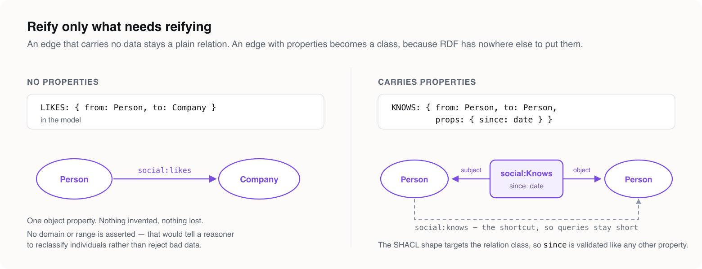

# A concept graph makes every relation a node. Your catalog needs two of them.

### Sowa's conceptual graphs gave reasoning agents a bipartite discipline and a type lattice. LPG Modeler keeps the discipline, drops the bookkeeping, and compiles the result to eight targets. Worked through the hardest question in retail: what counts as the same product, and what is allowed to stand in for it.

---

In 1984 John Sowa published *Conceptual Structures*, and with it a notation that has outlived almost everything built on top of it. A **conceptual graph** — concept graph, in the shorthand that stuck — has two kinds of node and one kind of edge:

```
[Person: volodia] → (owns) → [Car: *]
```

**Concept nodes**, drawn as rectangles, written in square brackets. A concept node carries a *type* and a *referent*: `[Person]` is the type alone, `[Person: volodia]` names an individual, `[Person: *]` is a generic — some person, unspecified.

**Relation nodes**, drawn as ovals, written in round brackets. `(owns)` is a node, not a line.

**Edges**, which carry nothing at all. No label, no direction beyond argument order, no properties. Their only job is to wire a relation node to its arguments.

And one construction rule that makes the whole thing work: the graph is **bipartite**. An edge always joins a concept to a relation. Never concept to concept, never relation to relation.

Above the graph sits a **type hierarchy** — a lattice, ordered by subsumption, written `Toy < Object`. And beneath it sits the payoff: because the structure is bipartite and typed, a concept graph translates mechanically into first-order logic. That is what made it the diagrammatic face of Common Logic, and what makes it keep coming back every time somebody builds a reasoning agent and discovers that a knowledge graph full of untyped edges will not support an inference.

**This article is about the one decision that mapping forces you to make**, and about a domain where getting it wrong is expensive in a way everybody has felt: the e-commerce catalog.


*(This picks up from [Concept Graphs and Frames for Reasoning AI Agents](https://ai.plainenglish.io/concept-graphs-and-frames-for-reasoning-ai-agents-56671b3022df), which lays out the concept-graph and frame vocabularies side by side. The frames half of the story — Minsky's slots and facets, mapped onto properties and their constraints — is [`frames-and-slots.md`](frames-and-slots.md); this article assumes it rather than repeats it.)*

---

## What bipartite buys, and what it charges

Making relations into nodes is not notational fussiness. Four things fall out of it, and every one of them is something a reasoning agent actually needs.

**Arity stops being two.** A binary edge can say `A substitutes for B`. It cannot say `A substitutes for B, in market DE, because of a recall, between March and June` — not without either inventing four parallel edges or stuffing a JSON blob onto one. A relation node just takes more arguments. Arity three, four, seven: same construction, no new machinery.

**Relations become addressable.** If `(owns)` is a node, something else can point at it. Provenance, a validity window, a retraction, a second relation that takes the first as an argument. This is the property that a graph of untyped edges simply does not have, and it is the reason every serious knowledge-graph project eventually reinvents reification badly.

**The type lattice does real work.** A relation's signature declares the type of each argument, and the lattice tells you whether a given concept conforms. That is type checking on a knowledge base, and it is why a concept graph can reject a malformed assertion where a property graph will cheerfully store it.

**The translation to logic is mechanical.** Bipartite plus typed arguments is, almost literally, a predicate and its terms. Nothing has to be guessed.

Now the bill.

**Nothing you ship on is bipartite.** Neo4j is not. LadybugDB is not. FalkorDB is not. GQL's graph types are not. An RDF triple store is, in a sense, worse — its edges are not nodes either, which is exactly why RDF has needed reification, then named graphs, then RDF-star, and still argues about it.

**Uniform reification is expensive.** Applied to every relation, the bipartite rule turns one edge into a node plus two edges. A graph of ten million relationships becomes thirty million elements. Every traversal that was one hop becomes two. Every query that read an edge property now reads a node.

**And most relations do not need any of it.** `(:Variant)-[:VARIANT_OF]->(:ProductModel)` has two arguments, carries no data, and nothing will ever point at it. Reifying it costs a node, two edges and a hop, and buys nothing at all.

So here is the claim this article is built on:

> **Bipartite is a decision procedure, not a storage format.** Sowa's rule is exactly right as a question to ask about every relation in your domain. It is exactly wrong as an answer applied uniformly to all of them.

**LPG Modeler lets you write both answers in one file.** A relation that stays a relation is an `edges:` entry — binary, typed, directed, and it may carry properties. A relation that has earned concept status is a `nodes:` entry, with edges to its arguments. Same model, same validation, same eight generated artifacts. And where the target genuinely is bipartite — the RDF side — the generator reifies the ones that need it and leaves the rest alone.

---

## Four questions, and a domain that answers them differently every time

The test for whether a relation deserves to be a concept node:

1. **Does it have more than two participants?** Then it has no choice.
2. **Does anything else need to point at it** — an audit record, a supersession, a provenance claim?
3. **Does it have a lifetime of its own,** independent of the things it joins?
4. **Would a human argue about it?** A relation that gets reviewed, approved, disputed or overridden is a *statement someone made*, and statements are things.

A "no" to all four means it is an edge. Say so and move on.

Now the domain. **Retail catalogs**, and specifically the question a shopping agent has to answer forty times a second: *the thing the customer asked for is not available — what may I offer instead, and am I allowed to?*

This is a good test because it contains, in one small ontology, both of the mistakes the concept-graph framing is meant to prevent. Let me take them in order.

---

## Mistake one: there is only one hierarchy

Sowa's type lattice is a hierarchy of **types**, ordered by subsumption. `Toy < Object` means every toy is an object, necessarily, as a matter of what those words mean.

A merchandising category tree looks exactly like that and is nothing like it. `/home/kitchen/kettles < /home/kitchen` is not a claim about the nature of kettles. It is a claim about where the kettles are *this quarter*, made by a category manager, revised before every seasonal reset, and different on every channel the retailer sells through.

**Putting the merchandising taxonomy into the type lattice is the single most common catalog modelling error I have seen**, and it is fatal in a specific way: a re-parenting becomes a schema migration. Somebody moves kettles under "small appliances" and you are writing DDL.

So the model carries two hierarchies deliberately, and says which is which.

The type lattice, in the schema, with `extends`:

```yaml
nodes:
  # The abstract root of the type lattice.
  CatalogConcept:
    id: n_concept
    abstract: true
    key: [conceptId]
    props:
      conceptId: { id: p_cid, type: STRING, required: true }
      lifecycle: { id: p_life, type: STRING, enum: Lifecycle }

  # The intension side: what a thing is, independent of anyone selling it.
  ProductConcept:
    id: n_product
    abstract: true
    extends: CatalogConcept
    props:
      title: { id: p_title, type: STRING, required: true, maxLength: 300 }
```

And the category poset, in the data, as an ordinary edge between ordinary nodes:

```yaml
  Category:
    id: n_cat
    extends: CatalogConcept
    key: [path]
    props:
      path:   { id: p_path, type: STRING, required: true, pattern: "^(/[a-z0-9-]+)+$" }
      label:  { id: p_clab, type: STRING, required: true }
      scheme: { id: p_schm, type: STRING }
      depth:  { id: p_depth, type: int8, min: 0, max: 8 }

edges:
  # The category poset, in the data. At most one broader category per category.
  HAS_BROADER:
    id: e_broad
    from: Category
    to: Category
    cardinality: { to: "0..1" }
```

`scheme` is there because there is never one taxonomy: GS1's, Google's, and the retailer's own all coexist, and all three are data. Re-parenting a category is an `UPDATE`. Adding a fourth scheme is an `INSERT`. Neither touches the schema, because neither is a claim about what kind of thing a kettle is.

---

## Mistake two: "the product" is one concept

Ask what a `Product` is and you will get five answers, all correct, from five departments.

Sowa's concept node has a **referent field** for precisely this reason — `[Product]` and `[Product: *]` and `[Product: #4012345678901]` are different assertions about different levels of specificity. LPG Modeler has no instance layer, because a schema tool has no business having one. What it has instead is `key:`, which is the schema-level statement of *what makes a referent a referent at this level*. And that turns out to be the whole disagreement, written down.

**Rung one: the manufacturer's thing.** Identified the way the manufacturer identifies it.

```yaml
  ProductModel:
    id: n_model
    extends: ProductConcept
    key: [brandCode, mpn]
    props:
      brandCode:  { id: p_brand, type: STRING, required: true, pattern: "^[A-Z0-9]{2,12}$" }
      mpn:        { id: p_mpn, type: STRING, required: true, maxLength: 64 }
      launchedOn: { id: p_launch, type: DATE }
```

**Rung two: the thing with a barcode on it.** A different key, on the same branch of the lattice.

```yaml
  Variant:
    id: n_variant
    extends: ProductConcept
    key: [gtin]
    props:
      gtin:         { id: p_gtin, type: STRING, required: true, pattern: "^([0-9]{8}|[0-9]{12,14})$" }
      condition:    { id: p_cond, type: STRING, enum: ConditionGrade }
      optionValues: { id: p_opts, type: "MAP(STRING, STRING)" }
      dimensions:   { id: p_dims, type: "STRUCT(lengthMm DOUBLE, widthMm DOUBLE, heightMm DOUBLE)" }
      netWeightG:   { id: p_wt, type: int, min: 0 }
```

`optionValues` is a map rather than a column set because the option vocabulary differs per category — shoe width, lens mount, tog rating — and a schema that enumerated them would be wrong by Tuesday. `condition` is an enum, and it is on the variant rather than the offer on purpose: a refurbished unit has a different barcode, different warranty and different returns treatment. It is not the same thing at a discount.

**Rung three: the extension side.** Everything above is what a thing *is*. An offer is a fact about the market.

```yaml
  Offer:
    id: n_offer
    extends: CatalogConcept
    mixins: [Effective]
    key: [merchantId, gtin, marketCode]
    props:
      merchantId:   { id: p_mid, type: STRING, required: true }
      gtin:         { id: p_ogtin, type: STRING, required: true, pattern: "^([0-9]{8}|[0-9]{12,14})$" }
      marketCode:   { id: p_mkt, type: STRING, required: true, pattern: "^[A-Z]{2}$" }
      currency:     { id: p_ccy, type: STRING, pattern: "^[A-Z]{3}$" }
      listPrice:    { id: p_lp, type: "DECIMAL(18,4)", min: 0 }
      netPrice:     { id: p_np, type: "DECIMAL(18,4)", min: 0 }
      availableQty: { id: p_qty, type: int, min: 0 }
    constraints:
      - id: c_netlist
        name: netNotAboveList
        assert: { lessThanOrEquals: [netPrice, listPrice] }
        message: a net price above the list price is a pricing error, not a discount
```

Three properties identify one offer and none of them alone does. That composite key is not bureaucracy — it is the reason the same barcode can be €40 in Germany and €52 in Austria without either row being wrong.

**Rung four: what the customer actually sees**, per channel and per locale — and the one type in the model declared `open: true`, because every channel adds fields this ontology has no business naming.

**Rung five: the physical batch.** A recall is true of a lot. It is never true of a variant, and a catalog that cannot say so recalls either far too much or far too little.

```yaml
  Lot:
    id: n_lot
    extends: CatalogConcept
    key: [lotCode]
    props:
      lotCode:    { id: p_lot, type: STRING, required: true }
      producedOn: { id: p_prod, type: DATE, required: true }
      bestBefore: { id: p_bb, type: DATE }
    constraints:
      - id: c_bb
        name: bestBeforeAfterProduction
        assert: { lessThan: [producedOn, bestBefore] }
        message: a lot cannot expire before it was made
```

Five rungs, five different keys, all descending from one abstract root — and that root is what lets supersession be said once instead of five times:

```yaml
  # Declared once, on the abstract root, because supersession happens at every rung:
  # a model supersedes a model, a listing supersedes a listing, and a substitution
  # rule supersedes the rule it replaced.
  SUPERSEDED_BY:
    id: e_sup
    from: CatalogConcept
    to: CatalogConcept
    cardinality: { to: "0..1" }
```

One declaration. Hold that thought — it costs more on some targets than others, and the generator is about to tell us exactly how much.


---

## The relations that stay edges

Run the four questions over the catalog's relationships and most of them come back "no" four times.

`VARIANT_OF`, `OFFERS`, `SOLD_BY`, `RENDERS`, `DRAWN_FROM`, `HAS_BROADER` — two participants, no data, nothing points at them. Edges, and they stay edges. Some carry a bound, because a bound is the cheapest real constraint there is:

```yaml
  # Bounded at both ends. Each variant realises exactly one model, and a model with
  # no variant is a catalog entry nobody can buy.
  VARIANT_OF:
    id: e_varof
    from: Variant
    to: ProductModel
    cardinality: { from: "1..*", to: "1" }
```

Then there is the interesting middle case: a relation with two participants that *does* carry data.

```yaml
  IN_CATEGORY:
    id: e_incat
    from: ProductConcept
    to: Category
    props:
      primary: { id: p_prim, type: boolean, required: true }
      rank:    { id: p_rank, type: int16, min: 0 }
```

A product's placement in a category has a fact about it — is this the primary placement, and how does it sort. In a strict concept graph, `primary` forces `(inCategory)` into a full relation node with three arguments. In a property graph it is an edge property, which is the right storage answer and a slightly dishonest logical one.

**LPG Modeler's position is that both are true, and which one you get should depend on the target rather than on the author.** So `IN_CATEGORY` is written once, as an edge with properties, and the generator decides. On the property-graph targets it stays an edge. On the RDF targets it reifies — because there, it has to.



Here is that decision, verbatim from the generated OWL:

```turtle
# (:Category)-[:HAS_BROADER]->(:Category) carries no properties,
# so it stays a plain object property. No domain or range is asserted.
assort:hasBroader a owl:ObjectProperty ; rdfs:label "HAS_BROADER" .

# (:ProductConcept)-[:IN_CATEGORY]->(:Category) carries properties, so it is
# reified into a class. 'inCategory' is the shortcut for querying.
assort:InCategory a owl:Class ; rdfs:label "IN_CATEGORY" .
assort:inCategorySubject a owl:ObjectProperty .
assort:inCategoryObject a owl:ObjectProperty .
assort:inCategory a owl:ObjectProperty .
assort:primary a owl:DatatypeProperty ; rdfs:range xsd:boolean .
assort:rank a owl:DatatypeProperty ; rdfs:range xsd:short .
```

That is Sowa's rule applied *selectively*, by a generator, at the boundary where it is actually required — and applied to exactly two of the thirteen edge types in this model, because exactly two of them carry data.

---

## The relations that became concepts

Two relations in this catalog answer "yes" to all four questions, and the model gives them boxes. Both live under an abstract parent whose only job is to mark the distinction:

```yaml
  # The relation-as-concept layer. A relation lands here when it has more than two
  # participants, or when something else needs to point at it. Everything that does
  # not is an edge, and stays one.
  CatalogRelation:
    id: n_rel
    abstract: true
    extends: CatalogConcept
    mixins: [Effective, Asserted]
```

`CatalogRelation` declares no properties of its own. What it carries is two mixins — *when this holds* and *who says so* — because a reified relation is a statement somebody made, and a statement with no author and no validity window is the thing this whole exercise exists to prevent:

```yaml
mixins:
  Effective:
    id: m_eff
    props:
      validFrom:  { id: p_vfrom, type: DATE, required: true }
      validUntil: { id: p_vuntil, type: DATE }

  Asserted:
    id: m_asrt
    props:
      assertedBy: { id: p_aby, type: STRING, required: true }
      basis:      { id: p_bas, type: STRING, enum: Basis }
      confidence: { id: p_conf, type: float, min: 0, max: 1 }
```

Mixins rather than declared properties, because *who said so* is not a subtype of anything — and they sit on the abstract parent rather than on each relation because every reified relation needs both.

Beyond that, `CatalogRelation` is a pure classification: the bipartite distinction surviving into the generated ontology as an assertion a consumer can query on, which we will see in a moment.

### Substitution: four arguments and an argument

The question the agent came to ask. The kettle is out of stock; what may I put in front of the customer?

```yaml
  Substitution:
    id: n_sub
    extends: CatalogRelation
    props:
      reason:           { id: p_srsn, type: STRING, enum: SubstitutionReason, required: true }
      direction:        { id: p_sdir, type: STRING, enum: SubstitutionDirection }
      marketCode:       { id: p_smkt, type: STRING, pattern: "^[A-Z]{2}$" }
      equivalenceScore: { id: p_eqs, type: float, min: 0, max: 1 }
      ruleId:           { id: p_rule, type: STRING, maxLength: 64 }
      customerNotice:   { id: p_note, type: STRING, maxLength: 500 }
```

Four participants — what is replaced, what replaces it, why, and where — plus a window and an author. It answers every one of the four questions, and it answers the fourth loudest: a substitution is **something a person or a model decided**, and it will be argued about.

Which is why `reason` is an enum and not a comment:

```yaml
  SubstitutionReason:
    id: x_subr
    values: [out_of_stock, discontinued, recall, price_break, regional_restriction, seasonal]
```

A recall substitution and a price-break substitution are the same shape and completely different acts. One is a safety obligation; the other is a margin decision. An agent that cannot tell them apart will, eventually, cheerfully offer a customer the product that was recalled — because "similar" was the only signal it had.

And `direction` exists because **substitution is not symmetric**, and modelling it as a symmetric edge is the bug:

```yaml
  SubstitutionDirection:
    id: x_subd
    values: [symmetric, forward_only]
```

A premium item may stand in for the own-brand one when the own-brand runs out. The reverse is a downgrade nobody authorised. One relation node, one slot, both facts.

The participants are edges from the relation node to its arguments — which is precisely Sowa's construction, written in a property graph:

```yaml
  REPLACES:
    id: e_repl
    from: Substitution
    to: Variant
    cardinality: { to: "1" }

  REPLACED_BY:
    id: e_replby
    from: Substitution
    to: Variant
    cardinality: { to: "1..*" }
```

Exactly one thing replaced. One or more things offered in its place, in preference order. And three constraints that turn the frame into something checkable:

```yaml
    constraints:
      - id: c_ground
        name: grounded
        assert: { atLeastOne: [equivalenceScore, ruleId] }
        message: a substitution is either measured or ruled; one with neither is a guess
      - id: c_window
        name: windowOrdered
        assert: { lessThanOrEquals: [validFrom, validUntil] }
        message: a substitution cannot stop applying before it starts
      - id: c_hasrepl
        name: hasReplacement
        assert: { count: { edge: REPLACED_BY, of: Variant, min: 1 } }
        message: a substitution with nothing on the other side is a stockout, not a substitution
```

`grounded` is the one that matters. `equivalenceScore` is what a model learned from behaviour; `ruleId` is what a merchandiser declared. **A substitution must be at least one of those.** A row with neither is a recommendation engine's guess wearing a catalog's clothes, and the constraint exists to keep it out of the catalog where an auditor will later read it as policy.

`validFrom` and `validUntil` are not declared on `Substitution` at all — they arrive from `Effective` by way of `CatalogRelation`, which is why `windowOrdered` can name them. **A constraint reads the type's flattened properties**, inherited and mixed-in alike, so a rule about a window written two levels up still belongs to the relation that has the window.

### Fitment: the boolean that ate the information

The second relation with a box. Does this filter fit this machine, does this strap fit this watch, does this cartridge fit this printer?

```yaml
  Fitment:
    id: n_fit
    extends: CatalogRelation
    props:
      strength:  { id: p_fstr, type: STRING, enum: FitmentStrength, required: true }
      positions: { id: p_pos, type: LIST<STRING> }
      note:      { id: p_fnote, type: STRING, maxLength: 300 }
```

Compatibility is the relation most often flattened into a boolean column, and `strength` is exactly what gets lost when it is:

```yaml
  FitmentStrength:
    id: x_fit
    values: [exact, requires_adapter, aftermarket]
```

`exact`, `requires_adapter` and `aftermarket` are all "true" to a boolean and three different answers to a customer. The returns rate of the third is not the returns rate of the first, and a `BOOLEAN fits` column is how a retailer learns that the expensive way.

Fitment is three-place — a part, one or more applications, and the strength of the claim:

```yaml
  FITS_PART:
    id: e_fitp
    from: Fitment
    to: Variant
    cardinality: { to: "1" }

  FITS_APPLICATION:
    id: e_fita
    from: Fitment
    to: ProductModel
    cardinality: { to: "1..*" }
```

And it carries the escape hatch, because one thing needed saying that a closed assertion vocabulary should not be able to say:

```yaml
    shacl: |
      sh:property [
        sh:path assort:strength ;
        sh:severity sh:Warning ;
        sh:description "aftermarket fitments are re-checked by the category manager each quarter" ;
        sh:in ( "exact" "requires_adapter" ) ;
      ] ;
```

`sh:Warning` means *flag this, do not reject it*. Aftermarket fitments are legitimate and also the ones that generate returns, so they get reviewed rather than blocked. No other target has a severity, and every one of them reports that it ignored the fragment.

### And the one that stayed an edge, on purpose

A kit line looks like it should be a relation node. It is not:

```yaml
  # A kit line: quantity and role are facts about the pairing and nothing points at
  # them, so this one stays an edge. Contrast with Substitution.
  CONTAINS:
    id: e_cont
    from: ProductModel
    to: Variant
    props:
      quantity: { id: p_qtyc, type: int, required: true, min: 1 }
      role:     { id: p_role, type: STRING, maxLength: 40 }
```

Two participants. Data about the pairing, yes — but nobody audits a kit line, nothing supersedes one, and it has no life independent of the kit. Three "no"s and a shrug. It is an edge, and the four questions are what let you say that with a straight face instead of reifying everything out of nervousness.

---

## Now compile it

```bash
npx lpg-modeler-cli check article/assortment.lpg.yaml
# 0 error(s), 0 warning(s)

npx lpg-modeler-cli emit article/assortment.lpg.yaml \
  --target ladybug --target neo4j --target falkordb --target shacl \
  --target owl --target gql --target pgschema --target linkml \
  --out ./schema
```

Twelve node types — nine concrete, three abstract — thirteen edge types, three mixins, seven enums. Eight artifacts. Here is what each target did with the same concept graph.

### OWL: the bipartite line, preserved as an axiom

This is the payoff for giving `CatalogRelation` a box of its own even though it declares no properties:

```turtle
assort:Substitution a owl:Class ;
  rdfs:label "Substitution" ;
  rdfs:subClassOf assort:CatalogRelation ;
  owl:hasKey ( assort:conceptId ) .

assort:Fitment a owl:Class ;
  rdfs:label "Fitment" ;
  rdfs:subClassOf assort:CatalogRelation ;
  owl:hasKey ( assort:conceptId ) .
```

A consumer of this ontology can ask *which of these classes are reified relations rather than things* and get an answer, in one triple pattern, without reading a comment or guessing from a naming convention. Sowa's rectangle-versus-oval distinction survives compilation as a subclass axiom.

Note what the OWL does **not** say. No `rdfs:domain`, no `rdfs:range` on the edges, no cardinality restrictions. The export is deliberately restricted to the safe assertional subset — classes, `subClassOf`, `hasKey`, disjointness, inverses.

This is worth being blunt about, because the concept-graph literature's "translates directly into first-order logic" is true of concept graphs and **not** true of a naive schema-to-OWL export. A property graph schema is a closed-world constraint: *these are the properties, and nothing else is allowed*. OWL is open-world inference: *from this, conclude more*. Emitting `rdfs:domain assort:ProductConcept` for `IN_CATEGORY` does not restrict what may be categorised. It instructs a reasoner to **reclassify** anything it finds with that relation as a `ProductConcept` — silently, and across your entire graph.

Fifteen years on, that is still the most misunderstood construct in applied semantics, and mapping a constraint naively into OWL does not lose information so much as invert its meaning. So the constraints go where closed-world is what they mean.

### SHACL: where the constraints actually land

Each named constraint becomes a shape of its own, so each keeps its own message:

```turtle
assort:Substitution_groundedShape a sh:NodeShape ;
  sh:targetClass assort:Substitution ;
  sh:message "a substitution is either measured or ruled; one with neither is a guess" ;
  sh:or (
    [ sh:path assort:equivalenceScore ; sh:minCount 1 ]
    [ sh:path assort:ruleId ; sh:minCount 1 ]
  ) .

assort:Substitution_hasReplacementShape a sh:NodeShape ;
  sh:targetClass assort:Substitution ;
  sh:property [
    sh:path assort:replacedBy ;
    sh:qualifiedValueShape [ sh:class assort:Variant ] ;
    sh:qualifiedMinCount 1 ;
    sh:message "a substitution with nothing on the other side is a stockout, not a substitution" ;
  ] .
```

That second shape is the concept-graph type-checking rule, in a standard validator. A relation node whose argument is missing, or is the wrong type, is rejected.

And cardinality comes out in **both directions** from one declaration. The forward bound on the relation, and the reverse as an inverse path on the type at the other end:

```turtle
  sh:property [
    sh:path [ sh:inversePath assort:variantOf ] ;
    # 1..*-to-1: each ProductModel has 1..* incoming VARIANT_OF.
    sh:minCount 1 ;
  ] .
```

One line of `cardinality: { from: "1..*", to: "1" }` in the model. Eight `sh:closed true` shapes elsewhere in the same file, for the eight types that are closed — and `Listing`, the open one, correctly gets none.

### LadybugDB: what one abstract root actually costs

Now the bill for declaring `SUPERSEDED_BY` once. LadybugDB flattens the hierarchy to one table per concrete type, so an edge between two abstract endpoints expands to the cross-product:

```cypher
CREATE REL TABLE IF NOT EXISTS SUPERSEDED_BY (
  // 'CatalogConcept' and/or 'CatalogConcept' are abstract; expanded to 81 endpoint pairs.
  FROM Category TO Category,
  FROM Category TO Fitment,
  FROM Category TO Listing,
  FROM Category TO Lot,
  FROM Category TO Merchant,
  FROM Category TO Offer,
  FROM Category TO ProductModel,
  ...
```

Nine concrete types squared. **Eighty-one endpoint pairs, written for you**, from one declaration — and the comment says so, at the site, rather than leaving an operator to work out why this table is four hundred lines long.

The composite key on `Offer` gets handled and reported:

```cypher
CREATE NODE TABLE IF NOT EXISTS Offer (
  merchantId STRING,
  gtin STRING,
  marketCode STRING,
  ...
  // SYNTHESIZED: composite key (merchantId, gtin, marketCode) is not expressible;
  // 'offer_key' must be written as the concatenation of those properties.
  offer_key STRING,
  PRIMARY KEY(offer_key)
);
```

And the composite property types survive intact — this is the one target that has them natively:

```cypher
CREATE NODE TABLE IF NOT EXISTS Variant (
  gtin STRING,
  condition STRING,
  optionValues MAP(STRING, STRING),
  dimensions STRUCT(lengthMm DOUBLE, widthMm DOUBLE, heightMm DOUBLE),
  netWeightG INT64,
  ...
  PRIMARY KEY(gtin)
);
```

### GQL: the same edge, once

The contrast that makes the abstract root worth keeping. GQL carries the hierarchy by label implication, so an edge on an abstract endpoint stays **one** element type:

```
  (:CatalogConcept)-[supersededByType: SUPERSEDED_BY => {
    // UNENFORCED: many-to-one in the model.
  }]->(:CatalogConcept),
```

One element type against eighty-one endpoint pairs. Same model, same declaration, and the difference is entirely in what the target can say — including the bound, which GQL reports rather than enforces.

Its element types carry the lattice explicitly:

```
  (fitmentType: Fitment => :CatalogRelation&CatalogConcept {
    // UNENFORCED: 'strength' is limited to enum 'FitmentStrength' in the model.
    strength :: STRING NOT NULL,
    positions :: LIST<STRING>,
    note :: STRING,
    validFrom :: DATE NOT NULL,
    validUntil :: DATE,
    assertedBy :: STRING NOT NULL,
    ...
    conceptId :: STRING NOT NULL IS NODE KEY,
```

`Fitment => :CatalogRelation&CatalogConcept` — the whole ancestor chain, including the marker that says this class is a relation.

### PG-Schema: nothing flattened at all

The most faithful target. Abstract types stay abstract, mixins stay mixins, and the composite key needs no synthesized column:

```
CREATE GRAPH TYPE assortType STRICT {
  ABSTRACT (assertedType {assertedBy STRING, OPTIONAL basis STRING, OPTIONAL confidence FLOAT}),
  ABSTRACT (effectiveType {validFrom DATE, OPTIONAL validUntil DATE}),
  ABSTRACT (localizedType {locale STRING, OPTIONAL fallbackLocale STRING}),
  ABSTRACT (catalogconceptType: CatalogConcept {conceptId STRING, OPTIONAL lifecycle STRING}),
  ABSTRACT (catalogrelationType: catalogconceptType & effectiveType & assertedType & CatalogRelation),
  (substitutionType: catalogrelationType & Substitution
     {reason STRING, OPTIONAL direction STRING, OPTIONAL marketCode STRING, ...}),
  (listingType: catalogconceptType & localizedType & Listing
     {listingId STRING, OPTIONAL channel STRING, OPTIONAL headline STRING, OPEN}),
```

`ABSTRACT (catalogrelationType: catalogconceptType & effectiveType & assertedType & CatalogRelation)` — an abstract type with no property block of its own, composed from a parent and two mixins, which is exactly what a pure classification is. And `OPEN` on `listingType`, the one place in the model that admits undeclared properties, expressed as a keyword rather than as a downgrade note.

### The rest, briefly

**FalkorDB** is the only database target that enforces `required`, and it takes the composite key without a synthesized column:

```
$REDIS_CLI GRAPH.CONSTRAINT CREATE "$GRAPH_KEY" UNIQUE NODE Offer PROPERTIES 3 merchantId gtin marketCode
$REDIS_CLI GRAPH.CONSTRAINT CREATE "$GRAPH_KEY" MANDATORY NODE Offer PROPERTIES 1 merchantId
```

**Neo4j** turns the lattice into labels and is honest about its edition: `// Substitution carries labels :Substitution :CatalogRelation :CatalogConcept (hierarchy flattened to labels).`, followed by every existence constraint reported as Enterprise-gated rather than quietly dropped.

**LinkML** lines `is_a` and `mixins` up with the metamodel almost directly, which is what opens the LinkML generator ecosystem to a model authored here:

```yaml
  CatalogRelation:
    class_uri: assort:CatalogRelation
    abstract: true
    is_a: CatalogConcept
    mixins:
      - Effective
      - Asserted
  ...
  Substitution:
    class_uri: assort:Substitution
    is_a: CatalogRelation
    # DOWNGRADE: grounded, windowOrdered, hasReplacement unenforced here.
```

---

## Nothing disappears quietly

That emit printed **440 diagnostics and zero errors** — 227 `info`, 213 `warning`. Not failures. Downgrades, each naming a type, a property, a target, and where the constraint went instead:

```
warning [ladybug] downgrade-open: Node type 'Listing' is open, but LadybugDB has a
      mandatory closed schema: a property the table does not declare cannot be
      written at all.

warning [neo4j] downgrade-composite: Property 'Variant.optionValues' has composite
      type MAP(string, string), which neo4j has no equivalent for. Declared as an
      untyped property; the structure inside it is not carried.

info  [ladybug] downgrade-named-constraint: Constraint 'Offer.netNotAboveList'
      asserts 'lessThanOrEquals', which ladybug cannot express. The SHACL artifact
      carries it.

info  [owl] downgrade-value-constraint: Property 'Category.path' bounds its values,
      which owl has no schema facility for. The SHACL artifact carries it.
```

Every one is an editor diagnostic **and** a comment at the lossy line of the generated artifact, so the operator reading the DDL learns what the author reading the model already knows. The severities are calibrated: a constraint that moved to SHACL is `info`, because it went somewhere; a map that silently flattened is `warning`, because that is the surprising kind of loss.

Four hundred and forty notes on a twelve-type model sounds like a lot until you consider the alternative, which is four hundred and forty silent decisions made by eight generators on your behalf.

---

## What it deliberately won't do

Three limits, stated here rather than discovered later — and all three are places where a concept graph says something this metamodel will not.

**Nested contexts.** Sowa's notation allows a concept box to contain an entire graph: `[Proposition: [Kettle] → (recalled) → [Lot]]`. That is how conceptual graphs express negation, modality and belief — *it is not the case that*, *the supplier claims that*. There is no such thing here. A concept node holds properties, never a subgraph, and a schema language has no business acquiring modal operators. If you need "the supplier claims X", that is a relation node with the supplier as an argument, written the way `Substitution` is written — and the `Asserted` mixin exists because that pattern turned out to be needed on every reified relation in this model.

**Relations over relations.** An edge whose endpoint is another edge — the metagraph case — is outside the core on purpose. Neo4j cannot represent it natively, so admitting it would force every emitter to grow a silent reification path, and silent reification is how a schema stops meaning what it says. If a substitution rule needs to point at another substitution rule, both are already concept nodes and a plain edge between them does the job. You reify deliberately, and you can see that you did.

**Constraints do not inherit.** `netNotAboveList` sits on `Offer`, not on `CatalogConcept`, and could not be moved up if you wanted it there: it reads two properties the parent does not have. A subtype that silently widened its parent's contract would leave the reader of the parent no way to see it.

---

## Try it

```bash
code --install-extension pavlyshyn.lpg-modeler
```

The model in this article is [`article/assortment.lpg.yaml`](assortment.lpg.yaml) — save it in a workspace, open the canvas beside the file, and generate whichever of the eight targets your stack actually runs.

Five more worked models ship with the project: a starter, an inheritance-and-mixins tour, enums and open types, endpoint bounds, and the full constraint vocabulary. Each is checked in CI — a test resolves every one and generates all eight targets, so the file you download is the file the test checked.

- **Docs** — https://volland.github.io/lpg-modeler/
- **Marketplace** — https://marketplace.visualstudio.com/items?itemName=pavlyshyn.lpg-modeler
- **Source** — https://github.com/Volland/lpg-modeler

---

Sowa's rule was never "reify everything." It was "know which of your relations are things." This catalog has eleven relations in it. Two of them are things — the substitution somebody will be asked to justify, and the fitment somebody will be asked to stand behind. The other nine are edges, and four more edges exist only to wire those two relations to their arguments.

The discipline is knowing the difference. The compiler is what makes knowing it pay.
