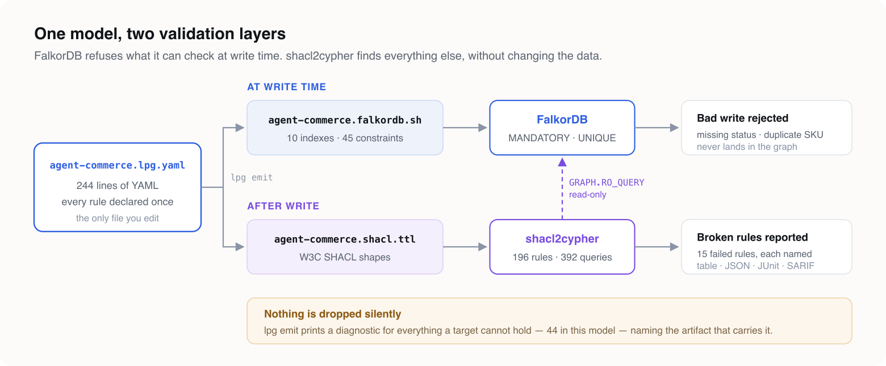
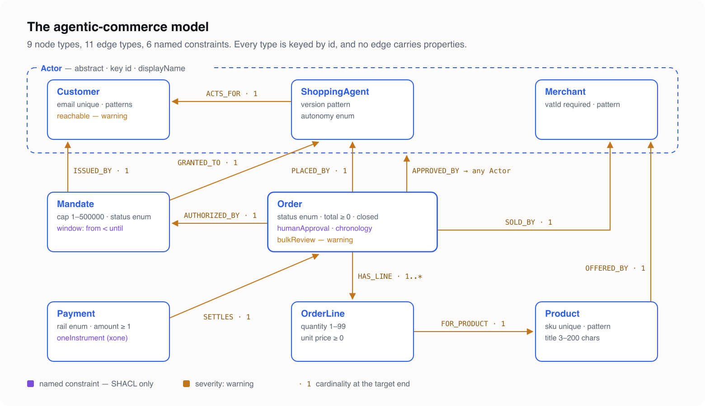

# An agent will write anything your graph accepts. Make the rules the schema.

### A shopping agent buys on a customer's behalf. One model file gives FalkorDB a strict schema that rejects bad writes at the door, and — through SHACL and shacl2cypher — 196 read-only Cypher checks for the business rules no database constraint can hold. Nothing is written by hand except the model.

---

An AI agent that places orders is a new kind of writer for your database. It is fast, tireless, and confidently wrong in ways a form with dropdowns never was. It will set `autonomy: "yolo"` because nothing said it could not. It will store a price as the string `"4500"`. It will approve its own purchase.

A schema-optional graph database accepts all of it. FalkorDB is schema-optional by design, and so is every other property graph that lets you start without a migration. That is the right default for exploring a domain. It is the wrong default for a system where software is spending a customer's money.

The usual fix is validation code: a service layer that checks every write, a nightly job that looks for orphaned orders, a test suite that encodes the business rules for the third time. That code drifts from the data model the day after it is written, and nobody can read it as a statement of what the business actually requires.

**This article takes the other route.** The rules are declared once, in a model file. Two tools compile that file into two validation layers for FalkorDB. You write no validation code — no Cypher, no service-layer checks, no SHACL by hand.

*(Everything below was run against FalkorDB 4.20.4 with LPG Modeler 0.11.0 and shacl2cypher 0.3.0, and every output block is pasted from that run.)*

---

## Two layers, one source

A database constraint and a business rule are different things, and they belong in different places.

**A database constraint is enforced at write time.** A write that breaks it is refused, so bad data never lands. The price is that a database can enforce only what its engine knows how to check. FalkorDB can require a property to exist (`MANDATORY`) and a value to be unique (`UNIQUE`), and that is all.

**A business rule is checked after the fact.** "An order an agent placed needs a customer's approval" is not something any property graph engine enforces. What you can do is find every order that breaks it, name the rule, and fail a pipeline.

One model file produces both:



[LPG Modeler](https://github.com/Volland/lpg-modeler) turns the model into the database's own constraint script and into W3C SHACL shapes. [shacl2cypher](https://github.com/Volland/shacl2cypher) compiles those shapes into named Cypher queries, runs them against FalkorDB through read-only `GRAPH.RO_QUERY`, and reports every violation with the rule that failed and the node that failed it.

The split is not arbitrary, and neither tool decides it silently. When LPG Modeler generates the FalkorDB script, it reports every rule FalkorDB cannot hold and points at the SHACL artifact that does. Nothing the model says is dropped without a line in the output saying where it went.

---

## The domain: agentic commerce

The model is [`agent-commerce.lpg.yaml`](agent-commerce.lpg.yaml) — download it and follow along. It is 244 lines: 9 node types, 11 edge types, 1 mixin, 4 enums and 6 named constraints.

**Actors.** `Customer`, `ShoppingAgent` and `Merchant` all extend an abstract `Actor`, which carries the `id` key and a display name. Approval is declared once, as an edge to `Actor`, because in principle anyone may approve. A rule further down says whose approval actually counts.

**Authority.** A `Mandate` is issued by one customer to one agent. It caps the spend in cents, names a currency, and has a validity window. An agent without a mandate has no business placing an order.

**Commerce.** An `Order` is placed by an agent, authorised by a mandate, sold by a merchant, and has one or more `OrderLine`s, each for a `Product`. A `Payment` settles an order.



Two conventions keep the graph and the shapes lined up without any mapping annotations. **Every type is keyed by `id`**, so shacl2cypher can identify any failing node with a single `--node-key id`. **No edge carries properties**, so every relation stays a plain relationship on both sides. An edge with properties becomes a class of its own in SHACL, and that shape would then no longer match the relationship in FalkorDB.

Here is `Order`, with its rules:

```yaml
  Order:
    id: n_order
    key: [id]
    props:
      id:         { id: p_order_id, type: string, required: true }
      status:     { id: p_order_status, type: string, required: true, enum: OrderStatus }
      totalCents: { id: p_order_total, type: int, required: true, min: 0 }
      currency:   { id: p_order_cur, type: string, required: true, pattern: "^[A-Z]{3}$" }
      placedAt:   { id: p_order_placed, type: datetime, required: true }
      updatedAt:  { id: p_order_updated, type: datetime }
    constraints:
      - id: c_chrono
        name: chronology
        assert: { lessThanOrEquals: [placedAt, updatedAt] }
        message: an order cannot be updated before it was placed
      # The business rule the whole model exists for: an agent may place an order,
      # but a human customer has to have approved it.
      - id: c_human
        name: humanApproval
        assert: { count: { edge: APPROVED_BY, of: Customer, min: 1 } }
        message: an agent-placed order needs a customer's approval
      - id: c_bulk
        name: bulkReview
        assert: { count: { edge: HAS_LINE, max: 20 } }
        severity: warning
        message: orders with more than 20 lines are reviewed by hand
```

---

## What the model declares

The rules fall into four groups. Each group maps onto the two layers differently, and that mapping is the argument of this article.

**Identity and presence.** `key: [id]`, `required: true`, `unique: true`. FalkorDB enforces these at write time. SHACL states them again as `sh:minCount 1`, so the validation report covers them as well. Uniqueness is the one rule that goes to the database alone, because core SHACL cannot express uniqueness across instances.

**Values.** `pattern` for a currency code, a SKU, a VAT number and a semantic version; `min` and `max` for quantities and amounts; `minLength` and `maxLength` for titles; `enum` for order status, mandate status, payment rail and agent autonomy; and a datatype on every property, so `"4500"` is not an integer. FalkorDB has no constraint for any of these, so they go to SHACL.

**Structure.** Edge cardinality — an order has exactly one mandate and at least one line, and a line belongs to exactly one order. Closed types — an order carries the properties it declares and no others. FalkorDB has no multiplicity constraint and cannot close a label, so these go to SHACL too. shacl2cypher's `sh:closed` goes further than an RDF engine would and also rejects outgoing relationship types the shape does not declare.

**Business rules.** Six named constraints, drawn from a closed vocabulary rather than an expression language:

- **`chronology`** — on an order, `placedAt ≤ updatedAt`.
- **`window`** — on a mandate, `validFrom < validUntil`.
- **`humanApproval`** — at least one `APPROVED_BY` edge to a `Customer`, not merely to any `Actor`.
- **`oneInstrument`** — a payment has exactly one of `cardToken` and `walletAddress`.
- **`reachable`** — a customer has at least one of `email` and `phone`. This one is `severity: warning`.
- **`bulkReview`** — at most 20 lines per order, also a warning: a large order is not wrong, but somebody should look at it.

Severity is part of the model. SHACL carries it as `sh:severity`, and shacl2cypher reports warnings separately from violations, so a pipeline can fail on the second and only log the first.

---

## Install the tools

You need four things: LPG Modeler to write the model and generate from it, FalkorDB, a `redis-cli` to talk to FalkorDB, and shacl2cypher. Only the last one has anything to compile.

**LPG Modeler, the editor.** The VS Code extension gives you completion and validation as you type, and a canvas that draws the model beside the file:

```bash
code --install-extension pavlyshyn.lpg-modeler
```

Open `agent-commerce.lpg.yaml` and run **LPG: Open Canvas** from the command palette. The inspector beside the canvas lists each type's constraints, and its constraint form includes the severity picker.

**LPG Modeler, the CLI.** The same parser and generators, for scripts and CI. It needs Node.js 18 or later. `npx` runs it without a global install, and a global install gives you the `lpg` command. Use 0.11.0 or later, because `severity` is new in 0.11:

```bash
npx lpg-modeler-cli@latest check agent-commerce.lpg.yaml   # or: npm install -g lpg-modeler-cli && lpg check …
```

**FalkorDB.** Run it in a container, pinned to the version this article was tested against. The container ships `redis-cli`, so there is nothing else to install:

```bash
docker run -d --name falkordb -p 6379:6379 falkordb/falkordb:v4.20.4
docker exec falkordb redis-cli PING     # PONG
```

Podman works the same way — the run for this article used `podman run` and `podman exec` with identical arguments.

**shacl2cypher.** Each GitHub release has prebuilt binaries for Linux x86_64, Linux arm64 and macOS arm64, and all three database backends are compiled in. On an Apple Silicon Mac:

```bash
V=v0.3.0; T=shacl2cypher-$V-aarch64-apple-darwin
curl -LO https://github.com/Volland/shacl2cypher/releases/download/$V/$T.tar.gz
curl -LO https://github.com/Volland/shacl2cypher/releases/download/$V/$T.tar.gz.sha256
shasum -a 256 -c $T.tar.gz.sha256
tar xzf $T.tar.gz && sudo mv $T/shacl2cypher /usr/local/bin/
shacl2cypher --version    # shacl2cypher 0.3.0
```

With a Rust toolchain (1.87 or later) you can build it instead. The FalkorDB backend is an opt-in cargo feature:

```bash
cargo install --locked shacl2cypher --features falkordb
```

The `shacl2cypher` packages on npm and PyPI can compile for FalkorDB, but they cannot open a FalkorDB connection yet. For this walkthrough, use the binary.

---

## Step 1 — check the model and generate both artifacts

```bash
npx lpg-modeler-cli check agent-commerce.lpg.yaml
npx lpg-modeler-cli emit  agent-commerce.lpg.yaml --target falkordb --target shacl --out schema
```

The check is clean:

```
0 error(s), 0 warning(s)
```

`emit` writes `schema/agent-commerce.falkordb.sh` and `schema/agent-commerce.shacl.ttl`. It also prints 44 downgrade diagnostics, and they are worth reading rather than skipping. Ten are warnings: FalkorDB cannot hold an edge's cardinality. Thirty-two are notes: FalkorDB cannot hold a value bound or a named constraint. Two of them, with the absolute path trimmed from the front of each line:

```
agent-commerce.lpg.yaml:202:3 warning [falkordb] downgrade-cardinality: Edge type 'AUTHORIZED_BY' declares *-to-1 cardinality, which FalkorDB has no constraint for: multiplicity is not part of its schema facility.
agent-commerce.lpg.yaml:139:9 info [falkordb] downgrade-named-constraint: Constraint 'Order.humanApproval' asserts 'count', which falkordb cannot express. The SHACL artifact carries it.
```

The last two warnings come from the SHACL side: the two `unique` properties, `email` and `sku`, which core SHACL cannot check. The FalkorDB script enforces both. Between them, the two artifacts cover every rule in the model.

Here is `humanApproval` in the generated SHACL. The rule is a qualified count: of all the `approvedBy` values, at least one must be a `Customer`.

```turtle
shop:Order_humanApprovalShape a sh:NodeShape ;
  sh:targetClass shop:Order ;
  sh:property [
    sh:path shop:approvedBy ;
    sh:qualifiedValueShape [ sh:class shop:Customer ] ;
    sh:qualifiedMinCount 1 ;
    sh:message "an agent-placed order needs a customer's approval" ;
  ] .

shop:Order_bulkReviewShape a sh:NodeShape ;
  sh:targetClass shop:Order ;
  sh:property [
    sh:path shop:hasLine ;
    sh:maxCount 20 ;
    sh:severity sh:Warning ;
    sh:message "orders with more than 20 lines are reviewed by hand" ;
  ] .
```

---

## Step 2 — apply the strict schema

The FalkorDB artifact is a shell script, not a `.cypher` file. FalkorDB creates an index through a Cypher query and a constraint through a separate Redis command, `GRAPH.CONSTRAINT CREATE`, and no single client sends both. Here is the `Order` section:

```bash
# Order
$REDIS_CLI GRAPH.QUERY "$GRAPH_KEY" "CREATE INDEX FOR (n:Order) ON (n.id)"
$REDIS_CLI GRAPH.CONSTRAINT CREATE "$GRAPH_KEY" UNIQUE NODE Order PROPERTIES 1 id
$REDIS_CLI GRAPH.CONSTRAINT CREATE "$GRAPH_KEY" MANDATORY NODE Order PROPERTIES 1 id
$REDIS_CLI GRAPH.CONSTRAINT CREATE "$GRAPH_KEY" MANDATORY NODE Order PROPERTIES 1 status
$REDIS_CLI GRAPH.CONSTRAINT CREATE "$GRAPH_KEY" MANDATORY NODE Order PROPERTIES 1 totalCents
$REDIS_CLI GRAPH.CONSTRAINT CREATE "$GRAPH_KEY" MANDATORY NODE Order PROPERTIES 1 currency
$REDIS_CLI GRAPH.CONSTRAINT CREATE "$GRAPH_KEY" MANDATORY NODE Order PROPERTIES 1 placedAt
```

Anything FalkorDB cannot hold is written into the script as a comment, so an operator reading it sees the same gaps the modeller saw:

```bash
# (:Order)-[:AUTHORIZED_BY]->(:Mandate)
# UNENFORCED: *-to-1 in the model; FalkorDB has no multiplicity constraint.
```

Point the script at the container and a graph named `commerce`:

```bash
REDIS_CLI="docker exec -i falkordb redis-cli" GRAPH_KEY=commerce sh schema/agent-commerce.falkordb.sh
```

It creates 10 indexes and 45 constraints: 10 `UNIQUE` and 35 `MANDATORY`. Each constraint comes back `PENDING`, because FalkorDB applies constraints asynchronously. Check that they all took, rather than assuming it:

```bash
docker exec falkordb redis-cli GRAPH.QUERY commerce \
  "CALL db.constraints() YIELD status RETURN status, count(*)"
```

```
status
count(*)
OPERATIONAL
45
Cached execution: 0
Query internal execution time: 0.307462 milliseconds
```

Now the database refuses bad writes. Here is an order with no status:

```bash
docker exec falkordb redis-cli GRAPH.QUERY commerce \
  "CREATE (:Order {id: 'ord_bad', currency: 'EUR', totalCents: 100, placedAt: localdatetime('2026-09-14T09:00:00')})"
```

```
mandatory constraint violation: node with label Order missing property status
```

And two products with the same SKU:

```
unique constraint violation on node of type Product
```

This layer costs nothing at runtime and has no gaps within its scope. But its scope is small. It stops an agent from forgetting a field. It does not stop an agent from filling that field with nonsense.

---

## Step 3 — load a graph an agent got wrong

[`agent-commerce.seed.cypher`](https://github.com/Volland/lpg-modeler/blob/main/article/agent-commerce.seed.cypher) builds a small shop: two customers, two agents, a merchant, two mandates, two products, three orders with their lines, and two payments. One order is correct from end to end. Everything else has a problem planted in it, and every write passes the strict schema, because every required property is present and every key is unique:

```bash
docker exec -i falkordb redis-cli GRAPH.QUERY commerce "$(cat agent-commerce.seed.cypher)"
```

```
Labels added: 22
Nodes created: 17
Properties set: 82
Relationships created: 26
Cached execution: 0
Query internal execution time: 1.502726 milliseconds
```

Fourteen problems were planted:

- A customer with neither email nor phone.
- A rogue agent whose version is `"latest"`, whose autonomy is `"yolo"`, and which acts for no one.
- A mandate that expires before it starts.
- A product whose SKU is `"camp stove"`.
- An order with status `"shipped_maybe"`, a line with quantity `0`, and approval from the agent that placed it.
- An order with a total of `"4500"` as a string, an `updatedAt` earlier than its `placedAt`, an undeclared `discountOverride` property, and no mandate at all.
- A payment charged to a card *and* a wallet.

FalkorDB accepted every one of them.

---

## Step 4 — compile the shapes to Cypher

shacl2cypher resolves SHACL onto a property graph by convention first, then by evidence from a schema snapshot. Labels come from class names, properties from predicate names, and relationship types from the predicate in upper snake case (`shop:placedBy` becomes `PLACED_BY`). LPG Modeler's generated SHACL follows the same conventions, so no mapping file sits between the two tools.

The conventions have one blind spot, and it matters here. A path counts as a relationship when its shape says so, for example with `sh:class`, or when a schema snapshot declares the relationship type. The type shapes LPG Modeler emits carry `sh:class` on every relation. The two count constraints do not: `humanApproval` and `bulkReview` have only a path and a count. Without a snapshot, shacl2cypher reads `approvedBy` as a *property* of the order, finds none, and flags every order, including the correct one. So take a snapshot of the live graph first. It is one command:

```bash
shacl2cypher schema dump --falkordb redis://localhost:6379 --graph commerce -o schema.json
```

Compiling on its own is useful too, because it shows exactly what will run:

```bash
shacl2cypher compile schema/agent-commerce.shacl.ttl --dialect falkordb \
  --schema schema.json --node-key id --neo4j-labels inherited -o out
```

```
compiled 196 rules (196 with queries, 1 static diagnostics) for falkordb into out
warning: schema/agent-commerce.shacl.ttl:25: s2c:SchemaMismatch: property `phone` is not declared on label `Customer`
```

196 rules: 194 at `Violation` severity and 2 at `Warning`, the ones the model marked. They are written as 392 named queries — a detail query and a summary query per rule — in 3,743 lines of Cypher that nobody wrote. The one static diagnostic is explained under step 5.

With the snapshot, `humanApproval` compiles to a real traversal. It follows `APPROVED_BY` and counts only the targets that carry the `:Customer` label:

```cypher
// name: Order_humanApprovalShape.approvedBy.qualifiedMinCount
// ruleId: shop:Order_humanApprovalShape/shop:approvedBy/sh:qualifiedMinCount
MATCH (v0:`Order`)
CALL { WITH v0 OPTIONAL MATCH (v0)-[x2:`APPROVED_BY`]->(x1) WHERE id(x2) >= 0 RETURN count(DISTINCT CASE WHEN x1 IS NOT NULL AND (x1:`Customer`) THEN x1 END) >= 1 AS c3 }
WITH v0, c3
WHERE NOT (c3)
``` `--neo4j-labels inherited` tells the queries that a node carries its supertype's label, as LPG Modeler's FalkorDB script arranges: a `Customer` node is also an `:Actor`. Here is the generated query for "an order has at least one line":

```cypher
// name: OrderShape.hasLine.minCount
// ruleId: shop:OrderShape/shop:hasLine/sh:minCount
MATCH (v0:`Order`)
CALL { WITH v0 OPTIONAL MATCH (v0)-[x2:`HAS_LINE`]->(x1) WHERE id(x2) >= 0 RETURN count(DISTINCT x1) >= 1 AS c3 }
WITH v0, c3
WHERE NOT (c3)
RETURN 'OrderShape.hasLine.minCount' AS ruleId, 'shop:OrderShape' AS shape, 'shop:hasLine' AS path, 'sh:minCount' AS `constraint`, 'Violation' AS severity,
       {label: head([l IN labels(v0) WHERE l IN ['Order']] + labels(v0)), key: 'id', keyValue: v0.`id`, elementId: toString(id(v0))} AS focus, null AS value, 'shop:OrderShape violates sh:minCount on shop:hasLine' AS message, [] AS details
LIMIT $limit;
```

Every relationship traversal is a correlated `CALL` subquery, because FalkorDB 4.20 evaluates some simpler forms wrongly. Knowing that is shacl2cypher's job, not yours.

`manifest.json`, written beside the queries, records the compiler version, the SHA-256 of every input, and one entry per rule with its severity and the line in the shapes file it came from.

---

## Step 5 — validate

```bash
shacl2cypher validate schema/agent-commerce.shacl.ttl \
  --falkordb redis://localhost:6379 --graph commerce \
  --node-key id --neo4j-labels inherited --schema schema.json
```

Here is the report, as printed. Rules that passed are left out:

```
warning: schema/agent-commerce.shacl.ttl:25: s2c:SchemaMismatch: property `phone` is not declared on label `Customer`
STATUS      SEVERITY   VIOLATIONS  TIME(ms)  RULE
failed      Warning             1        18  Customer_reachableShape.or
            - Customer id=cust_bob7730: a customer the agent cannot reach cannot confirm a purchase (value: {"elementId":"1","keyValue":"cust_bob7730","label":"Customer"})
failed      Violation           1       184  Mandate_windowShape.validFrom.lessThan
            - Mandate id=mand_002: a mandate must end after it starts
failed      Violation           1         2  OrderLineShape.quantity.minInclusive
            - OrderLine id=line_1002_1: shop:OrderLineShape violates sh:minInclusive on shop:quantity (value: 0)
failed      Violation           1         3  OrderShape.closed
            - Order id=ord_1003: shop:OrderShape violates sh:closed
failed      Violation           1         2  OrderShape.authorizedBy.minCount
            - Order id=ord_1003: shop:OrderShape violates sh:minCount on shop:authorizedBy
failed      Violation           1         2  OrderShape.status.in
            - Order id=ord_1002: shop:OrderShape violates sh:in on shop:status (value: "shipped_maybe")
failed      Violation           1         2  OrderShape.totalCents.datatype
            - Order id=ord_1003: shop:OrderShape violates sh:datatype on shop:totalCents (value: "4500")
failed      Violation           1         1  OrderShape.totalCents.minInclusive
            - Order id=ord_1003: shop:OrderShape violates sh:minInclusive on shop:totalCents (value: "4500")
failed      Violation           1       180  Order_chronologyShape.placedAt.lessThanOrEquals
            - Order id=ord_1003: an order cannot be updated before it was placed
failed      Violation           1         2  Order_humanApprovalShape.approvedBy.qualifiedMinCount
            - Order id=ord_1002: an agent-placed order needs a customer's approval
failed      Violation           1        26  Payment_oneInstrumentShape.xone
            - Payment id=pay_2: a payment is charged to exactly one instrument (value: {"elementId":"16","keyValue":"pay_2","label":"Payment"})
failed      Violation           1         2  ProductShape.sku.pattern
            - Product id=prod_stove: shop:ProductShape violates sh:pattern on shop:sku (value: "camp stove")
failed      Violation           1         2  ShoppingAgentShape.actsFor.minCount
            - ShoppingAgent id=agent_rogue001: shop:ShoppingAgentShape violates sh:minCount on shop:actsFor
failed      Violation           1         2  ShoppingAgentShape.autonomy.in
            - ShoppingAgent id=agent_rogue001: shop:ShoppingAgentShape violates sh:in on shop:autonomy (value: "yolo")
failed      Violation           1         2  ShoppingAgentShape.version.pattern
            - ShoppingAgent id=agent_rogue001: shop:ShoppingAgentShape violates sh:pattern on shop:version (value: "latest")

196 rules: 181 passed, 15 failed, 0 timed out, 0 errors, 0 skipped, 0 guaranteed by schema; 15 violations in 612 ms
```

All fourteen planted problems were found, and nothing else was flagged. They fail fifteen rules because the string `"4500"` breaks two: it is not an integer, and it is not a number at least 0. Every line names the rule, the node by its key, and — where the model wrote one — the human-readable message. The run exits with status 1 because violations were found.

`humanApproval` is the rule worth looking at. The correct order and the one without a mandate were both approved by Ana, a `Customer`, and both pass. `ord_1002` has an approval too, but from the agent that placed it, and the qualified count sees that the approving node is not a `Customer`. Without the snapshot, the same run reported this rule against all three orders.

The single `SchemaMismatch` warning is also accurate. No customer in this graph has a phone number, so the snapshot has never seen `phone` on the `Customer` label. The rules that use `phone` still ran.

---

## What each layer caught


**At the door, FalkorDB refused** the order with no status and the duplicate SKU. Those writes never happened, and nothing downstream has to deal with them.

**In the graph, shacl2cypher found** everything else: a value of the wrong type, a value outside its range, a value outside its enum, a malformed identifier, a missing relationship, an undeclared property, a date range that ends before it starts, an approval from the wrong kind of actor, and a payment with two instruments. None of these can be a FalkorDB constraint. All of them are in the model.

Together, the two layers cover every rule the model declares. The emit output says which layer holds which rule, so the coverage can be checked rather than taken on trust.

---

## Put it in CI

Validation is read-only, so it is safe to run against production on a schedule, after every batch of agent writes, or in a pipeline before a release. Compile once and run the manifest:

```bash
shacl2cypher compile schema/agent-commerce.shacl.ttl --dialect falkordb \
  --schema schema.json --node-key id --neo4j-labels inherited -o out

shacl2cypher validate --manifest out/manifest.json \
  --falkordb redis://localhost:6379 --graph commerce \
  --format junit -o junit.xml --fail-on violation
```

`--format sarif` points each violation at the line of the shapes file that declared the rule. `--fail-on warning` promotes `reachable` and `bulkReview` to failures. The exit code separates the cases a pipeline has to treat differently: `0` clean, `1` violations at or above the threshold, `2` a setup problem such as an unreachable database, `3` an incomplete run because a query timed out.

---

## What "code-free" does and doesn't mean

What was written: one 244-line YAML file.

What was generated from it: 10 indexes and 45 constraints for FalkorDB, and 196 validation rules as 392 queries. Change the model, regenerate both artifacts, and both layers move together. There is no second place where a rule has to be edited.

Three limits are worth stating plainly.

**Validation is detection, not prevention.** Only presence and uniqueness are refused at write time. Everything else is found after the write. For an agent that acts on the data it has just written, run validation before acting, or treat the report as a gate on the next step.

**The vocabulary is closed on purpose, and some rules are outside it.** "An order's total does not exceed its mandate's cap" and "the mandate was active when the order was placed" compare values across two nodes. No named-constraint kind expresses that today. shacl2cypher rejects SHACL-SPARQL, so raw SPARQL is not a way around it either. Those rules still need code, or a future vocabulary kind.

**The snapshot is part of the setup.** A count over an edge needs the schema snapshot to read its path as a relationship. It costs one command, but it has to be run against a graph that already contains the relationship types.

---

## Try it

Download [`agent-commerce.lpg.yaml`](agent-commerce.lpg.yaml) and [`agent-commerce.seed.cypher`](https://github.com/Volland/lpg-modeler/blob/main/article/agent-commerce.seed.cypher). Open the model in VS Code with the canvas beside it, then run the five steps above against a local FalkorDB. Then break something the seed does not break — add a line with a negative price, or revoke a mandate — and watch the report name it.

LPG Modeler is at [github.com/Volland/lpg-modeler](https://github.com/Volland/lpg-modeler), and shacl2cypher is at [github.com/Volland/shacl2cypher](https://github.com/Volland/shacl2cypher). Both are MIT licensed.

For why the model is shaped the way it is — frames and slots, facets, and why a mixin is not a supertype — [`frames-and-slots.md`](frames-and-slots.md) works through a trust ontology for the same agentic-commerce world.
