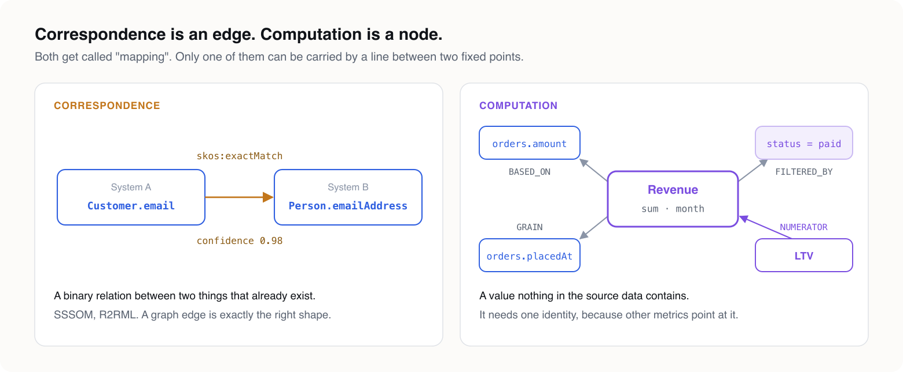
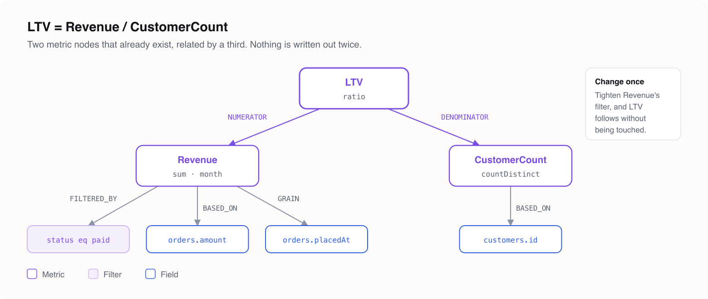

# The semantic layer nobody agrees on — and what a property graph model can actually give it

### "Semantic layer" has come to mean three unrelated things: a domain model, an ontology, and a metrics layer. A single structural model can give you the first two, generated and in step. It will never give you the third, and it shouldn't try.

---

Every data team eventually has the same argument, and it never resolves cleanly: *what does "Revenue" mean?* Finance sums one set of tables. Sales sums another. The dashboard someone built two years ago sums a third. Everyone is technically correct, and everyone is talking about a different number.

The industry's answer to this is "the semantic layer" — but the term has quietly come to mean three unrelated things, and conflating them is where most implementations go wrong.

---

## Three layers, three jobs

**A domain model** is how one application sees the world. It's the classes, tables, and objects a specific piece of software needs to run — closed-world, tightly coupled to implementation, and deliberately narrow. It doesn't try to be true outside its own bounded context, and it shouldn't.

**An ontology** is a formal, open-world specification of what terms mean, precise enough that parties who've never met can agree on them and a reasoner can derive facts nobody stated explicitly. It's written in OWL, validated with SHACL, and its whole point is to survive contact with systems it wasn't designed for.

**A semantic layer**, in the sense the BI world means it — dbt's Semantic Layer, Cube, LookML, and now the vendor-neutral effort at Apache Ossie — is neither of those. It's a business-facing abstraction that maps physical fields to business terms and, more importantly, **defines metrics**: `Revenue = SUM(orders.amount)`, with a specific join path, a specific time grain, a specific filter for what counts. It has no reasoning, no open-world assumption, and usually no idea an ontology exists.

All three get called "semantic" because all three sit between raw data and human meaning. But they answer different questions, and are owned by different people:


Building one when you need another is how you end up with an OWL ontology nobody queries, or a metrics layer that silently disagrees with the ontology sitting three systems over.

---

## Structure vs. meaning: the mapping that isn't a metric

Here's the distinction that matters most in practice, and it's easy to miss because both things get called "mapping."

If you have one property and another property and you draw an edge between them saying they correspond — `Customer.email` in System A *is* `Person.emailAddress` in System B — that's real, and it's a well-known problem with well-known tools. SSSOM formalizes exactly this: `skos:exactMatch`, `skos:closeMatch`, `skos:broadMatch`, with confidence and justification attached. R2RML does the relational-to-RDF version of the same thing. This is **correspondence** — a binary relation between two things that already exist. A graph edge is exactly the right shape for it.

But

```
Revenue = SUM(orders.amount) - SUM(refunds.amount)
          grouped by region, at monthly grain
```

is not a correspondence between two existing properties. It's a **computation** — a function over a set of rows that produces a value nothing in the source data directly contains. No edge can carry that, because an edge connects two fixed points and an aggregate isn't a point, it's an operation.

This is exactly why Ossie's metrics are SQL-dialect expressions, not join predicates. The moment you need `SUM`, a filter, a time grain, or a ratio of two other metrics, you need something that holds several parts together as one addressable thing. That means it needs to be a **node**, not an edge — because you need to reference "this metric" from elsewhere as a single identity.



Get this wrong and you build a semantic layer that can tell you two fields mean the same thing but can't tell you what Revenue is. That's most of the "semantic layer" projects that quietly stall.

---

## Where structural modeling actually earns its keep

This is where LPG Modeler becomes relevant — not because it *is* a semantic layer, but because it solves the problem underneath one honestly.

A property graph schema usually lives in four places that drift independently: the DDL that created the tables, a constraint script someone ran last quarter, a diagram in a wiki that stopped being true, and an ontology a different team maintains. LPG Modeler collapses all four into one YAML model and projects it outward: DDL and constraints for LadybugDB, Neo4j, FalkorDB and Memgraph, SHACL shapes, an OWL ontology, and the GQL, PG-Schema and LinkML standards targets — all from the same type hierarchy, keys, and properties. The diagram is drawn from the model itself, with its coordinates kept in a sidecar file so rearranging boxes never shows up in the semantic diff.

Abstract types and mixins are flattened before any generator sees the model, so a `Truck` that inherits from `Vehicle` and applies a `Timestamped` mixin produces the same concrete properties whether the target has inheritance (OWL) or none at all (LadybugDB). Nothing generates from a model with errors, and everything a target can't enforce is reported as a downgrade rather than silently dropped.

What this buys you is **structural honesty**. The same model that defines your queryable schema also defines the formal ontology terms other systems can reference, and the SHACL shapes that constrain the data. They can't drift apart, because they're not separate artifacts — they're one artifact, projected many ways.

But it's worth being precise about what kind of "mapping" this is. It's a structural, one-to-one projection — the same category as an ORM or R2RML — not a semantic layer in the metrics sense. `Person.email` means the identical thing in every target, just expressed in that target's syntax. Nothing is being resolved, arbitrated, or computed.

That's a feature, not a gap: it's exactly what lets the tool guarantee deterministic, reviewable diffs. But it means the actual semantic-layer job — defining what Revenue *is*, reconciling Finance's definition with Sales's — still needs a layer on top.

---

## A minimal ontology for the part that was missing

If you want to close that gap without losing the structural guarantee, the model turns out to be small — five classes, not fifty:

- **`Dataset`** and **`Field`** — the structural layer, already produced by anything like LPG Modeler.
- **`Mapping`** — correspondence between two fields, with `mappingType` reusing SKOS's `exactMatch` / `closeMatch` / `broadMatch` / `narrowMatch` vocabulary rather than inventing a new one.
- **`Metric`** — a named, computed value: `basedOn` a field, an `aggregateFn` (`SUM`, `COUNT`, `AVG`, …), zero or more `filteredBy` predicates, a `grain` field for the aggregation window, and — critically — `numerator` / `denominator` edges pointing to *other Metrics*, not fields.
- **`Filter`** — the predicate a metric is evaluated under.

That `numerator` / `denominator` detail is what makes composition work. `LTV = Revenue / CustomerCount` is two existing metric nodes related by a third, not a fresh expression written from scratch each time.



Deliberately absent: a `Dimension` class. A dimension isn't a different *kind* of thing — it's a field being used for grouping. Giving it its own class buys no new structure, just a sixth name to keep straight.

### The ontology is itself a model

Here's the part that's easy to get backwards. The *metrics* don't belong in a schema file — but the *vocabulary* they're written in does. `Metric`, `Filter` and `MAPS_TO` change about as often as any other schema, and deserve the same review. So the five-class ontology is an ordinary LPG Modeler model: [`semantic-layer.lpg.yaml`](semantic-layer.lpg.yaml).


Two choices in it are the argument of this post, stated as schema:

- **`MAPS_TO` is an edge with properties**, not a node. Correspondence is a relation between two fields that already exist, and its mapping type, confidence and justification ride on that relation. Only OWL, which has no edge properties, turns it into a class — `sem:MapsTo` — and the tool does that on its own.
- **`Metric` is a node**, because `NUMERATOR` and `DENOMINATOR` have to point at it. A computation you can't reference can't be composed.

The shared `name` and `description` come from a `Named` mixin, and `mappingType`, `aggregateFn`, `grainUnit` and a filter's `operator` are enums, so the SKOS vocabulary is closed in the SHACL shapes rather than by convention.

```bash
npx lpg-modeler-cli check semantic-layer.lpg.yaml
npx lpg-modeler-cli emit  semantic-layer.lpg.yaml --target owl --target shacl --target neo4j --out ./schema
```

The model checks clean. Emitting to LadybugDB reports what that engine can't hold — required properties, enum value sets, the minimum on `FIELD_OF` — as downgrades, and the SHACL shapes carry all of it.

### Nothing moves

The whole thing is ETL-shaped in its transform primitives — `Mapping` is a field-level transform, `Metric` is exactly a `GROUP BY` / `WHERE` / aggregate step — but it isn't ETL. Nothing moves. There's no schedule, no materialization, no lineage tracking, no state to manage.

It's the "T" in ELT, decoupled entirely from the "EL": a stateless definition layer that gets *compiled* into a query at read time. That's the same relationship [shacl2cypher](rules-without-code.md) has to SHACL, or Ossie's `dialects.expression` has to SQL. The model says what a term means; something downstream turns that into a query against data that never left where it already lives.

---

## Why the separation matters more than the convenience

It would be tempting to fold `Metric` and `Mapping` straight into the LPG Modeler format — one file, one tool, done. I'd argue against it, for a reason that has nothing to do with elegance and everything to do with who edits the file and how often.

A schema changes rarely and is reviewed by engineers who care whether a diff is structural. A metric definition changes constantly, is owned by analysts, and its correctness is a business-review problem, not a generator-capability problem. There's no equivalent of "LadybugDB has no `NOT NULL`" for "this metric definition is wrong."

Mixing the two into one file means every metric tweak forces a schema review cycle. And the thing that makes the structural model trustworthy — that every diff in it is a diff you can review by eye, in seconds — quietly stops being true.

Better: keep the structural model exactly as disciplined as it is now, and treat the semantic layer's structural half as one more generated *target*, the same way LPG Modeler already treats LadybugDB, Neo4j, SHACL, and OWL as separate projections of one source. A projection into Ossie's `datasets` / `fields` / `relationships` shape would reuse the same flattening the tool already applies to inheritance and mixins.


The metrics themselves live in their own file, hand-authored, referencing the generated names, and change on a completely different cadence from the schema. It's the same pattern the tool already uses to keep diagram layout out of the semantic diff, one layer further out.

---

## The point of separating all of this

None of this is really about tooling preference. It's about being honest with yourself when someone asks "do we have a semantic layer?" and the true answer is "we have three things wearing the same name":

- a domain model that knows its own application,
- an ontology that knows how to mean something to strangers,
- and, if you're lucky, a metrics layer that knows what Revenue actually is this quarter.

A property graph model can give you the first two for free, generated from a single reviewable source. It will never give you the third, because the third was never a structural fact to begin with. It was always a decision someone has to own.

---

## Where to go next

- [`semantic-layer.lpg.yaml`](semantic-layer.lpg.yaml) — the metrics ontology from this post, ready to open in the canvas or emit.
- [Targets](../docs/targets.html) — every projection of the model, and what each one can and cannot enforce.
- [Rules without code](rules-without-code.md) — SHACL compiled to Cypher with shacl2cypher: the read-time compilation this post leans on.
- [You don't have to choose](you-dont-have-to-choose.md) — why one model can serve both RDF and property graphs.
