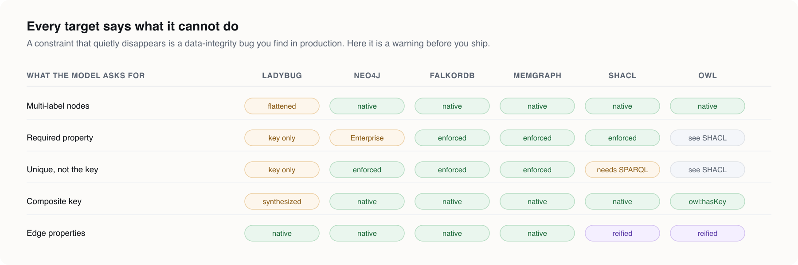

# You don't have to choose between RDF and the property graph

### Introducing LPG Modeler — design your domain the way you actually think about it, then decide what it compiles to.

---

There's a question that shows up in the first week of every graph project, usually before anyone has written a single line of domain logic:

> *"So — are we doing RDF or a property graph?"*

And whatever you answer, you've just made an architectural commitment on the worst possible day: the day you know the least about your domain.

Answer **RDF** and you get IRIs, a shared vocabulary, SHACL validation, reasoning, and interoperability with anyone who speaks the same standards. You also get a modelling surface where "this edge has a timestamp" is not a one-liner, and where half your team spends a sprint learning why `rdfs:domain` doesn't do what its name suggests.

Answer **property graph** and you get edges that carry data natively, Cypher, an embedded engine you can run in a unit test, and a schema your DBA recognizes. You also get a model that lives inside one vendor's DDL, that nobody outside your org can consume, and that has no story at all for "what does this type *mean*."

The honest answer to the question is: **you don't know yet, and you shouldn't have to.**

That's the premise LPG Modeler is built on.

---

## The insight: the format is a compilation target, not a modelling decision

Here's the thing almost every graph tool gets backwards.

When you sit down to describe a domain — a fleet, a catalog, a family tree, a booking system — the things you actually want to say are format-agnostic:

- *A truck **is** a vehicle, and a vehicle **is** an asset.*
- *An asset gets **stationed at** a depot — and that's true of every kind of asset.*
- *Half my types **carry** `createdAt` and `updatedAt`, and that says nothing about what they are.*
- *A child has **exactly two** parents.*
- *`fuel` is one of: diesel, electric, hydrogen.*

Not one of those sentences mentions RDF or LPG. They're statements about your domain. The format question — *how do I express "exactly two" in Neo4j?* — is a downstream translation problem, and it's a problem a machine should solve, not you.

So: **model in the natural vocabulary. Then choose your target. Then choose a different one next quarter.**


*The YAML file is the only thing you edit. Parse → resolve → validate → emit. A model with errors never produces an artifact at all. The diagram shows the four core targets; three standards artifacts — GQL graph types, PG-Schema, and LinkML — come off the same emit stage.*

---

## What LPG Modeler is

A **VS Code extension and a CLI**. You author a Labeled Property Graph schema as reviewable YAML, edit it on an ERD-like canvas beside the file, and generate **seven** artifacts from that single model:

| Target | What it is |
| --- | --- |
| **LadybugDB DDL** | Node and rel tables, typed columns, primary keys, multiplicity — an embedded Cypher engine (formerly Kuzu) |
| **Neo4j constraints** | Node keys, uniqueness, existence, indexes — edition-aware |
| **SHACL shapes** | Closed-world validation that genuinely rejects invalid data |
| **OWL ontology** | The safe assertional subset — classes, `subClassOf`, `hasKey`, disjointness, inverses |
| **GQL graph types** | ISO/IEC 39075 — the actual standard |
| **PG-Schema** | The LDBC formalism GQL's graph types grew out of |
| **LinkML** | Opens the whole LinkML generator ecosystem to your model |

Four of those live on the property-graph side of the fence. Three live on the RDF/linked-data side. **They come from the same file.** That's the whole point.

You're not picking a religion. You're picking an output directory.

```bash
npx lpg-modeler-cli emit fleet.lpg.yaml \
  --target ladybug --target shacl --target owl --target pg-schema \
  --out ./schema
```

---

## The canvas: modelling that looks like modelling

The extension opens a canvas beside your YAML file, the way Markdown preview does. Every box is a node type. Every row is a property. Every action on the canvas becomes a *targeted text splice* into the YAML — not a re-serialization — so moving a box produces no semantic diff at all. Coordinates live in a sidecar file.


This is `fleet.lpg.yaml`, one of five checked-in example models. Look at what the diagram is telling you:

- **`Asset` and `Vehicle` are drawn with a dashed border and an `ABSTRACT` badge.** They emit no table. They exist to say what things *are*.
- **`Truck` sits three levels down.** `assetTag` arrived from `Asset`, `vin` from `Vehicle` — and each inherited row names its source with `↑`.
- **`createdAt`, `latitude`, `longitude` are marked `◇` instead of `↑`.** They came from a mixin, and a mixin is not a supertype. Different symbol, because it's a different claim about the type.
- **`STATIONED_AT` is drawn from `Asset` alone** — even though `Truck`, `Van`, and `Trailer` all have it. More on that in a moment; it's the best idea in the tool.

Every one of those screenshots is a capture of the real webview rendering a real projection of a published example model. Not a mockup. The details a screenshot exists to carry — the `↑` against the `◇`, the mixin checkboxes — are exactly the ones a mockup gets subtly wrong.

---

## Feature 1: Inheritance — what a thing *is*

A node type may extend one other type. It gains that type's properties, and — when it declares none of its own — its **key**.

```yaml
nodes:
  Asset:
    abstract: true
    key: [assetTag]                    # declared once, inherited by everything below
    props:
      assetTag: { type: string, required: true }

  Vehicle:
    abstract: true
    extends: Asset
    props:
      vin:  { type: string, required: true, unique: true }
      fuel: { type: string, enum: Fuel }

  Truck:
    extends: Vehicle                   # three levels deep
    props:
      axles: { type: int, min: 2, max: 6 }
```

Two things this buys you that are hard to get otherwise.

**One: it kills the copy-paste.** You are not maintaining `assetTag` in six places and discovering in production that one of them drifted.

**Two — and this is the one people underrate — it is the backbone that makes an ontology export worth producing at all.** Without `subClassOf`, OWL output degenerates into a flat list of unrelated classes. A hierarchy is the difference between "we exported some RDF" and "we published a vocabulary."

The cost of inheritance is borne entirely by the emitters, and they each pay it differently:

- **PG-Schema** keeps it whole — `ABSTRACT`, inheritance, keys, all direct counterparts. Nothing flattened.
- **GQL** carries it through *label implication*: a concrete type is identified by its own label and implies every ancestor's.
- **LinkML** maps it to `is_a`.
- **Neo4j** has native multi-label nodes, so the hierarchy flattens to labels.
- **LadybugDB** has no inheritance at all, so it flattens to one node table per concrete leaf with inherited columns copied down.

You wrote one sentence. Five targets translated it five different ways. That's the deal.

---

## Feature 2: Mixins — what a thing *carries*

A mixin is a **named bag of properties** a node type applies. It declares no supertype. It has no identity. It never appears in an ancestor chain.

```yaml
mixins:
  Timestamped:
    props:
      createdAt: { type: zoneddatetime, required: true }
      updatedAt: { type: zoneddatetime }

nodes:
  Truck:
    extends: Vehicle
    mixins: [Timestamped, Located]     # set membership, not subtyping
```

This distinction is enforced rather than blurred, and the reason is worth stating plainly:

> **`createdAt` on twenty types does not make twenty subtypes of a `Timestamped`.**

Conflating reuse with subtyping produces a hierarchy shaped by *which properties happen to travel together* rather than by *what a thing is*. That hierarchy then leaks into your ontology, your query patterns, and eventually your team's mental model of the domain. It is one of the most common and most expensive modelling mistakes in graph work, and most tools make it easy because they only give you one mechanism.

Here it's two mechanisms, and the UI insists on the difference:


**`Extends` is a dropdown.** One parent, or none. **Mixins are checkboxes.** Applying one is set membership, and a type may apply several. That's not a UI preference — it's the metamodel made visible.

And because a mixin is not a label, **it costs the emitters nothing.** Its properties are flattened into every type that applies it before any target sees the model. A target with rich subtyping and a target with none generate the same columns.

The resolution rule is: *the nearer declaration wins.* A type's own property beats a mixin's; a mixin's beats an ancestor's. Both a shadowed property and a mixin nothing applies get reported, because neither is visible in the file.

Mixins are also editable in their own right:


A mixin has no box on the canvas, because it is not a type. It gets the panel instead — its properties, and **every type that applies it**, so a change to `Timestamped` shows you what it would touch *before* you make it. Rename it and every `mixins:` list that names it gets rewritten as a targeted edit.

---

## Feature 3: Relations are inherited too — and that's the quiet superpower

This is the feature I'd lead with if I only got one.

```yaml
edges:
  STATIONED_AT:
    from: Asset          # the abstract root
    to: Depot
    cardinality: { to: "0..1" }
```

Declared **once**, on an abstract type that has no instances. Every descendant has it. `Truck`, `Van`, `Trailer` — all stationed at a depot, and you said it a single time.

*An edge declared on an abstract parent belonging to every descendant is what makes the parent worth declaring in the first place.* A hierarchy that only shares columns is a convenience. A hierarchy that shares **relationships** is a domain model.

But now look at what the tool does with that fact, because there are three different right answers and it gives all three:

**On the diagram**, `STATIONED_AT` is drawn on `Asset` alone. Drawing it again from every subtype would suggest four declarations where the model has one — and on a hierarchy of any real depth it multiplies lines faster than it adds information. *The diagram says where a thing is written.*

**In the inspector**, `Truck` lists `DRIVES ← Driver ↑Vehicle` and `STATIONED_AT → Depot ↑Asset`. Marked with the ancestor each reaches it through. Because the question a modeller actually asks is *"what can this type relate to?"* — and the honest answer to that is **a list, not a picture.**

**In the targets**, expansion — and each one differently:

- **GQL** keeps it as one element type, because label implication means the abstract endpoint still resolves.
- **PG-Schema** keeps the abstract endpoint verbatim.
- **LadybugDB** has no abstract types, so a single `STATIONED_AT` expands to a **cross-product of four concrete `FROM`/`TO` pairs**.

One line in your model. Four lines of DDL. And when you add a fifth asset subtype next month, you don't touch the edge at all.

That's the compression. You describe the domain at the altitude the domain actually has, and the tool pays the translation cost at every level below it.

---

## Feature 4: Nothing disappears quietly

Here's the part that separates a schema generator from a schema *tool*.

Every target ships a **typed capability set**. The compiler computes what your model requires, compares it against what each target can express, and reports every gap — as an editor diagnostic *and* as a comment injected at the exact lossy line of the generated artifact.



Read that table carefully, because it's full of things you'd otherwise find out the hard way:

- **LadybugDB, measured against 0.19.1: `NOT NULL` is not accepted by the parser, and a null non-key value inserts successfully.** So a `required` property that isn't the key is *unenforceable there*. That is reported, loudly, rather than generated as a comforting lie.
- **Neo4j existence and node-key constraints are Enterprise-only.** Under a Community configuration they're emitted as comments and flagged.
- **`unique` that isn't the key** needs a SPARQL-based constraint in SHACL, which core SHACL cannot express. Reported.
- **A composite key** in LadybugDB doesn't parse, so it's emitted as a synthesized concatenated column. In PG-Schema it needs no synthesis at all.

A capability value isn't even always yes-or-no. LadybugDB declares cardinality as **`upper-bound-only`**, because its multiplicity keyword says "at most one at this end" and *nothing else*. Rounding that up to "enforced" would be the exact overstatement the matrix exists to prevent.

The philosophy in one line: **a `required` constraint that quietly vanishes is a data-integrity bug that surfaces in production.** So it doesn't quietly vanish. It becomes a warning before you ship.

And where a constraint has *nowhere* to go? It goes to SHACL. Value bounds, patterns, length limits, named cross-property constraints, edge counts, and a raw-SHACL escape hatch for the long tail. Five of the seven targets can carry no value constraint at all — but the model still records the intent, and every target says out loud that it couldn't hold it.

---

## The RDF crossing: reify only what needs reifying

If you *do* take the RDF exit, there's one structural mismatch you can't hand-wave: **RDF has no edge that carries properties.** A triple is three things. Where does `since: date` go?

The usual answers are both bad. Reify everything uniformly and your graph becomes unreadable and your queries triple in length. Use RDF-star and OWL DL reasoners stop working, while SHACL can't constrain quoted triples at all.

LPG Modeler does neither:


**An edge with no properties stays a plain object property.** Nothing invented, nothing lost. Notably, no `rdfs:domain` is asserted either — that would instruct a reasoner to *reclassify* individuals rather than reject bad data, which is the opposite of a constraint.

**An edge that carries properties becomes an n-ary relation class, plus a shortcut property** so your queries stay short. Its SHACL shape targets the relation class, so `since` is validated like any other property.

This is why the RDF export is **split in two**. A property graph schema and an OWL ontology do not mean the same thing: a schema is closed-world constraint, OWL is open-world inference. Mapping constraints naively into OWL doesn't lose information so much as **invert its meaning**. So SHACL gets the constraints, and OWL gets a restricted assertional subset — classes, `subClassOf`, `hasKey`, disjointness, inverse properties — that stays inside OWL DL and keeps reasoners working.

*(For the curious: property graphs with edge properties are already accidental metagraphs — an edge property is an implicit reified edge. Gradual reification just makes the implicit thing explicit exactly where it has to be, and nowhere else.)*

---

## What else is in the box

**Twenty-one scalar types**, drawn from what LadybugDB stores natively — five integer widths plus four unsigned, two floats and a parameterized `decimal`, four temporal types, `uuid`, `blob`, `json`. Every one has at least two spellings: the plain name and the **GQL (ISO/IEC 39075) or LadybugDB name**, so `ZONED_DATETIME` and `zoned datetime` are one type and your model reads the way the schema it generates does.

**Composite types** — `STRUCT`, `MAP`, `UNION`, fixed-size `ARRAY` — nesting to any depth, in LadybugDB's own syntax. They reach a LadybugDB column exactly as written. Everywhere else they degrade to a declared scalar (the element type when it's uniform, `json` otherwise) and report it.

**Cardinality as bounds, not an enum.** `{ to: "2" }` means *exactly two* — "a child has exactly two parents", which no combination of `many` and `one` can express. SHACL carries it exactly and in **both directions**: the forward bound as `sh:minCount`/`sh:maxCount`, the reverse as the same counts under an `sh:inversePath`. The named forms (`many-to-one` and friends) stayed as sugar.

**Enums, open/closed types, composite keys.** Closure is never inherited — a subtype that admitted extra properties would silently widen its parent's contract, and the reader of the parent would have no way to see it.

**Model composition across files.** Import under a local alias, subtype an imported label, declare edges touching imported types — but never mutate an imported definition. Sealed imports stay referentially transparent, and the diamond case resolves by **IRI identity, not file path**, so a vocabulary vendored at two different paths still resolves to one thing.

**Stable element IDs**, written once by the tool. They make a rename distinguishable from a drop-plus-add — which a structural diff alone cannot do, and which is exactly the mistake that generates a migration that destroys data. They also anchor diagram layout, so renaming a type moves nothing on screen.

**PNG and SVG diagram export**, including a print-safe light mode with a palette chosen for contrast *after grayscale conversion*, not just for hue.

**And it runs in CI**, with no editor present:

```bash
npx lpg-modeler-cli check model/domain.lpg.yaml
```

Gate a pull request on schema validity. The `core` package is forbidden from importing `vscode` — enforced by a lint rule *and* by a test that scans the source — which is precisely what makes this possible.

---

## Who this is for

**You're standing at the RDF/LPG fork and you don't want to commit yet.** Model now, decide later, change your mind at low cost. This is the whole thesis.

**You're already on Neo4j or LadybugDB and your schema lives in tribal knowledge and a wiki page.** Get a reviewable artifact, a diagram that's always current, and CI enforcement — plus an ontology export you didn't have to plan for.

**You're a knowledge-graph or semantic-web person who needs to hand something to a database team.** They get DDL. You get SHACL and OWL. Nobody has to learn the other side's stack.

**You're doing data integration or an agent memory layer** and need the same domain model expressed for a query engine *and* for validation *and* for interchange, without three hand-maintained copies drifting apart.

**You're a team that reviews schema changes in pull requests.** Semantics live in YAML; layout lives in a sidecar. Moving a box produces a zero-line semantic diff. Renaming a type touches exactly the lines that name it.

---

## The bet

Most graph modelling tools are a picture *of* a schema. This one is a **compiler** with a picture attached.

The bet is that the durable asset in your project isn't the DDL, and isn't the diagram either — it's the **statement of what your domain means**. Formats churn. Engines get replaced. The standards are still settling; GQL was only ratified in 2024. Whatever you commit to today, something will change under you.

So write down what you actually know: *a truck is a vehicle, every asset gets stationed somewhere, half these types just carry timestamps, a child has exactly two parents.* Write it once, in a file a human can read and a reviewer can diff.

Then let the machine argue with each target about how to say it — and let it tell you, out loud, every time a target can't.

---

## Try it

```bash
# VS Code
code --install-extension pavlyshyn.lpg-modeler

# CLI
npx lpg-modeler-cli check   model/domain.lpg.yaml
npx lpg-modeler-cli emit    model/domain.lpg.yaml --target ladybug --out schema
```

Then run **`LPG: New Model`** from the palette. It asks for a prefix and a base IRI, writes the file, and opens the canvas beside it — with one seeded type that already has a key, because a model that generates nothing on its first run reads as a broken tool rather than an empty one.

Or start from a real one. Five complete examples, each resolved and generated across all seven targets by a test in CI — so the file you download is the file the test checked:

| Model | What it shows |
| --- | --- |
| `social.lpg.yaml` | The starter — an abstract parent contributing a key, a mixin, an edge with an abstract endpoint |
| `fleet.lpg.yaml` | **Inheritance and mixins** — three-level hierarchy, three mixins at different levels, an edge declared once on the root *(the model in every screenshot above)* |
| `catalog.lpg.yaml` | Enums, list-valued properties, a composite key, an open type — where the targets start disagreeing |
| `kinship.lpg.yaml` | Endpoint bounds — exactly two parents, which no named multiplicity can express |
| `booking.lpg.yaml` | Value bounds, patterns, named constraints, and the raw SHACL escape hatch |

**Docs:** https://volland.github.io/lpg-modeler/
**Marketplace:** https://marketplace.visualstudio.com/items?itemName=pavlyshyn.lpg-modeler
**Source:** https://github.com/Volland/lpg-modeler — MIT

Currently at **v0.7.0**. Migrations, a Memgraph target, and user-supplied template targets are on the roadmap. Issues and modelling war stories both welcome.

---

*Stop choosing your graph format on day one. Choose it on the day you actually know.*
